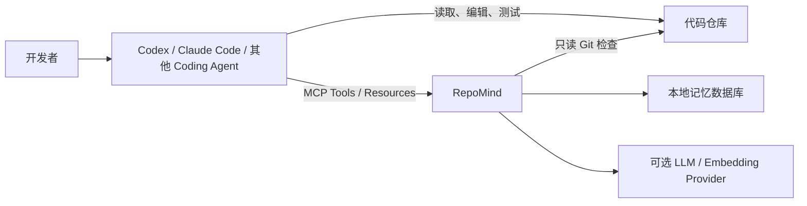
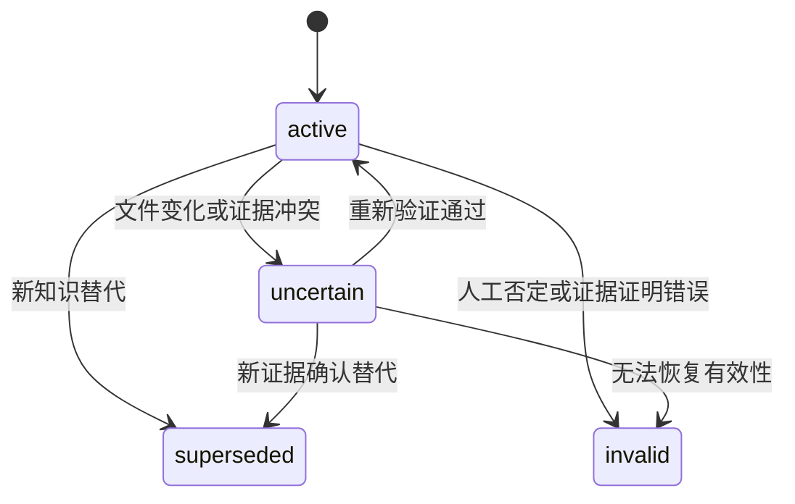

# RepoMind 最终产品形态与验收要求

> 文档状态：Target v1.0  
> 目标读者：项目开发者、贡献者、评审者、面试官  
> 适用范围：本地单用户版本  
> 文档目的：定义 RepoMind 最终要成为怎样的产品，以及项目达到什么标准才算完成  
> 配套文档：`REPOMIND_PROJECT_PLAN.md` 负责说明开发路径，本文负责说明最终结果

---

## 1. 最终定义

RepoMind 最终应成为一个面向 Coding Agent 的、本地优先的代码仓库长期记忆基础设施。它独立运行于 Codex、Claude Code 或其他 Agent 之外，通过 MCP、CLI 和可选宿主适配器，把多次编码会话中的需求、实现、测试、失败、技术决策和 Git 变化沉淀为带证据、可检索、可更新、可纠正的仓库知识，并在后续任务开始或执行期间提供少量、相关、可信且具有时效说明的记忆。

一句话定义：

> RepoMind 让不同 Coding Agent 在同一个代码仓库中延续可靠的工程记忆，而不必反复阅读全部历史会话。

最终产品不是新的 Coding Agent，也不是聊天机器人。它是 Agent 可以调用的独立记忆层。

---

## 2. 最终解决的问题

最终版本必须实质性解决以下问题：

1. 新会话不知道以前做过什么，需要重复阅读和探索。
2. 不同 Agent 之间无法共享仓库相关经验。
3. 历史对话太长，完整注入上下文成本高且噪声大。
4. 普通向量检索只能发现语义相似内容，不能判断事实是否仍然有效。
5. 模型总结容易产生没有来源、无法审计的“记忆”。
6. 仓库代码变化后，旧结论可能继续被错误召回。
7. 重复失败、架构约定和调试经验没有稳定的沉淀机制。
8. 记忆系统的收益通常只有演示，没有可复现实验支撑。

RepoMind 的价值不以“保存了多少条记录”衡量，而以以下结果衡量：

- Agent 更少重复读取已经理解过的文件。
- Agent 更少重试已经确认失败的方案。
- Agent 能遵守历史架构决策和项目约定。
- Agent 能说明召回知识的来源和当前有效性。
- 相同任务在启用记忆后以更低 Token 成本或更高成功率完成。

---

## 3. 最终用户体验

### 3.1 初始化

用户在 Git 仓库根目录执行：

```bash
repomind init
```

系统应完成：

1. 识别 Git 根目录。
2. 创建 `.repomind/project.json`，保存稳定的项目 UUID。
3. 在用户数据目录创建独立 SQLite 数据库。
4. 执行数据库 Migration。
5. 检查 FTS5、Git、数据目录和可选向量扩展。
6. 输出当前 Agent 的 MCP 配置示例。

初始化不得扫描或上传整个仓库，也不得把记忆数据库放入 Git 仓库。

### 3.2 接入 Agent

用户只需将 RepoMind 注册为 MCP Server：

```json
{
  "mcpServers": {
    "repomind": {
      "command": "repomind",
      "args": ["mcp"]
    }
  }
}
```

同一份本地记忆应可以被多个支持 MCP 的客户端使用。客户端差异只允许存在于配置或薄适配层中，不得进入 Core 领域模型。

### 3.3 第一次开发会话

```text
用户提出任务
  -> Agent 调用 repo_session_start
  -> RepoMind 保存 Git 基线并返回相关历史记忆
  -> Agent 正常读取、编辑和测试
  -> Agent 调用 repo_session_commit
  -> RepoMind 收集最终 Git 证据
  -> 提炼、验证并保存长期记忆
```

第一次会话没有历史记忆时，系统应正常返回空结果，不得因此阻断 Agent 工作。

### 3.4 后续会话

当用户提出相关任务时，RepoMind 应返回：

- 最相关的架构决策、项目约定或历史解决方案。
- 记忆类型、作用域、置信度和状态。
- 简短的 Evidence 摘要。
- 关联文件及其变化情况。
- 对过期或存在冲突的明确警告。

默认返回结果必须短小，不能把完整 Diff、完整日志或全部历史会话直接塞入上下文。

### 3.5 人工管理

用户应能通过 CLI：

- 搜索和查看记忆。
- 查看记忆对应的 Evidence 和状态变化历史。
- 手工记录明确事实。
- 修正错误记忆。
- 将记忆标记为有效、存疑、已替代或无效。
- 删除指定记忆及其关联数据。
- 导出、导入、备份和重建索引。
- 查看异常 Session 和系统健康状态。

---

## 4. 最终交付形态

最终项目至少包含以下交付物：

| 交付物 | 最终形态 |
| --- | --- |
| RepoMind Core | 与 MCP 和具体模型无关的 TypeScript 领域服务 |
| RepoMind CLI | 可全局安装的 `repomind` 命令 |
| MCP Server | 基于 stdio 的稳定 MCP 服务 |
| Local Storage | SQLite + FTS5，向量能力可插拔 |
| Git Inspector | 受限、只读、跨平台的仓库状态采集模块 |
| LLM Adapter | OpenAI-compatible 接口及可测试的 Mock 实现 |
| Embedding Adapter | 可配置、可禁用、支持本地缓存的向量接口 |
| Governance Engine | 去重、冲突、过期、替代、纠错和遗忘机制 |
| Evaluation Suite | 可复现的跨会话 Benchmark 和结果报告 |
| Documentation | 安装、架构、协议、安全、演示和贡献文档 |
| Skill Candidate Exporter | 只生成待审核候选，不自动安装或执行 Skill |

发布形态建议：

```text
npm install -g repomind
repomind init
repomind mcp
```

在内部代码稳定后，可以拆分为：

```text
@repomind/core
@repomind/cli
@repomind/mcp
@repomind/eval
```

拆包不是最终验收的必要条件。清晰的模块边界和公共接口稳定性比包数量更重要。

---

## 5. 产品边界

### 5.1 必须负责

RepoMind 必须负责：

- 仓库身份识别与数据隔离。
- Coding Session 的开始、提交、失败和放弃。
- Git、测试、任务摘要等 Evidence 的持久化。
- 从 Evidence 提炼结构化仓库记忆。
- 记忆检索、排序和上下文预算控制。
- 记忆来源解释和状态管理。
- 仓库变化后的过期风险检测。
- MCP、CLI 和 Core API 的统一语义。
- 本地数据安全和可恢复性。
- 定量评测与失败分析。

### 5.2 明确不负责

RepoMind 最终版本仍不负责：

- 自己生成或修改业务代码。
- 提供任意 Shell、浏览器、编辑器等通用工具。
- 取代 Git、LSP、代码搜索或代码图系统。
- 保存并重放完整聊天记录。
- 自动相信 Agent 或 LLM 给出的所有结论。
- 自动执行生成的 Skill。
- 在单用户目标内实现组织、权限和云协同。
- 构建与核心价值无关的 Web 管理后台。

### 5.3 与 Coding Agent 的关系



RepoMind 增强 Agent，但不接管 Agent 的计划、推理和工具循环。

---

## 6. 最终架构要求

### 6.1 分层结构

```text
MCP / CLI / Host Adapter
          |
Application Services
          |
Repository Memory Core
          |
Storage / Git / LLM / Embedding Ports
          |
SQLite / Git CLI / Provider Adapters
```

### 6.2 架构约束

- `CORE-001`：Core 不得依赖 MCP SDK。
- `CORE-002`：Core 不得依赖特定 Agent 的会话格式。
- `CORE-003`：存储、Git、LLM 和 Embedding 必须通过明确接口接入。
- `CORE-004`：所有写入型业务流程必须由 Application Service 管理事务。
- `CORE-005`：MCP 与 CLI 必须复用同一组 Application Service，不得复制业务规则。
- `CORE-006`：LLM 只能生成候选数据，不能直接写数据库。
- `CORE-007`：所有模型输出必须经过结构校验、证据校验和确定性规则。
- `CORE-008`：向量服务不可用时，核心检索功能必须继续工作。
- `CORE-009`：数据库 Schema 必须通过版本化 Migration 演进。
- `CORE-010`：公开接口和错误码必须有稳定的版本策略。

### 6.3 推荐模块

```text
src/
  application/
    session/
    memory/
    recall/
    governance/
  domain/
    repository/
    session/
    evidence/
    memory/
  adapters/
    sqlite/
    git/
    llm/
    embedding/
  mcp/
  cli/
  config/
  observability/
```

目录名称可以调整，但依赖方向不得反转。

---

## 7. 最终记忆分层

### 7.1 L0：Evidence / Session Trace

L0 是可审计的底层证据，包括：

- 用户任务描述。
- Agent 完成或失败摘要。
- Git 基线和最终快照。
- 有大小上限的 Git Diff。
- 测试命令、退出码和结果摘要。
- 关键命令结果摘要。
- 文件路径、Hash 和 Commit。
- 人工提交的事实。

最终要求：

- L0 不直接作为默认召回正文。
- 所有内容经过大小限制和敏感信息过滤。
- 超限内容至少保留 Hash、摘要、截断标记和来源信息。
- Evidence 一经引用不得静默修改。

### 7.2 L1：Atomic Memory

L1 是主要检索单位，每条只表达一个独立事实：

- `architecture`
- `convention`
- `decision`
- `command`
- `failure`
- `solution`
- `dependency`
- `location`
- `requirement`
- `risk`

最终要求：

- 自动生成的 L1 必须绑定至少一个 Evidence。
- 标题和正文必须能够脱离原会话理解。
- 必须包含仓库、类型、作用域、置信度、状态和时间信息。
- 不保存“完成了任务”这类不可复用流水账。
- 同一事实不能无限生成语义重复项。

### 7.3 L2：Module Narrative

L2 是模块级的有界叙事，聚合：

- 模块职责和边界。
- 关键文件与入口。
- 重要技术决策。
- 常见失败和验证方式。
- 历史演化与当前风险。

最终要求：

- L2 必须由有效 L1 和 Evidence 派生。
- L2 必须支持增量重建。
- 每个结论应能追踪到下层记忆。
- 内容必须有长度预算，不能退化成长文档仓库。

### 7.4 L3：Repository Profile

L3 是仓库级稳定摘要，包括：

- 技术栈和运行环境。
- 目录与模块职责。
- 构建、测试和检查命令。
- 核心架构决策。
- 长期约束和高风险区域。

最终要求：

- 可以作为任务开始时的可选基础上下文。
- 更新时保留来源和版本。
- 不得因单次低置信度会话覆盖稳定事实。
- 必须限制 Token 预算。

### 7.5 L4：Skill Candidate

L4 从多次成功执行中发现重复工作流，例如发布检查、Migration 验证和特定故障排查。

最终要求：

- 至少由多次独立成功证据支持。
- 输出触发条件、输入、步骤、验证和风险。
- 标记来源仓库和适用范围。
- 只能导出为待审核候选。
- 未经用户确认不得安装、启用或执行。

---

## 8. Evidence 要求

- `EVD-001`：Memory 与 Evidence 必须分表存储并使用关联表连接。
- `EVD-002`：Evidence 必须包含不可变 ID、类型、内容 Hash 和创建时间。
- `EVD-003`：文件类 Evidence 应记录仓库相对路径和文件 Hash。
- `EVD-004`：Git Evidence 应记录相关 Commit、HEAD 或工作区状态。
- `EVD-005`：测试 Evidence 应记录命令、退出码和结果摘要。
- `EVD-006`：系统必须区分用户陈述、Agent 摘要、模型推断和客观执行结果。
- `EVD-007`：客观测试与当前代码的可信度应高于无验证的模型推断。
- `EVD-008`：Inspect 必须展示一条记忆为什么存在。
- `EVD-009`：敏感信息被清理后必须留下已清理标记，不能伪装成原始完整内容。
- `EVD-010`：删除 Evidence 前必须处理其与 Memory 的引用关系。

---

## 9. Session 要求

### 9.1 状态

```text
open -> committed
open -> partial
open -> failed
open -> abandoned
```

### 9.2 行为要求

- `SES-001`：Start 必须记录任务、Branch、HEAD 和 Dirty 状态。
- `SES-002`：Commit 必须记录最终 Git 状态并计算相对基线变化。
- `SES-003`：Commit 必须支持幂等键。
- `SES-004`：重复提交不得生成重复 Evidence 或 Memory。
- `SES-005`：未正常结束的 Session 不得自动生成高置信度长期记忆。
- `SES-006`：用户可以查看和放弃长期处于 `open` 的 Session。
- `SES-007`：LLM 失败时，应保存可恢复的 Session 结果或明确回滚，不得产生半条记忆。
- `SES-008`：RepoMind 不得假设可以自动看到宿主 Agent 的其他工具调用。
- `SES-009`：宿主 Hook 可补充 Trace，但不能成为 MCP 基础能力的硬依赖。

---

## 10. 记忆生命周期与治理

### 10.1 状态模型



### 10.2 最终要求

- `GOV-001`：默认召回 `active`，可低权重召回带警告的 `uncertain`。
- `GOV-002`：`superseded` 和 `invalid` 默认不进入 Agent 上下文。
- `GOV-003`：状态改变必须写入 Audit Log。
- `GOV-004`：新记忆写入前必须执行候选去重。
- `GOV-005`：冲突内容不得被静默合并为单一事实。
- `GOV-006`：替代关系必须保存新旧 Memory ID。
- `GOV-007`：人工纠正的优先级高于后续无直接证据的自动推断。
- `GOV-008`：文件变化只能先触发风险判断，不能简单删除全部关联记忆。
- `GOV-009`：用户必须可以物理遗忘指定范围的数据。
- `GOV-010`：所有治理决策必须可以解释原因。

### 10.3 过期检测

最终至少支持：

- 关联文件 Hash 变化。
- 关联文件删除或重命名风险。
- Git Commit 或 Branch 差异。
- 依赖清单和锁文件变化。
- 新 Evidence 与旧事实冲突。
- 用户明确声明旧决策已经废弃。

过期判断必须区分“需要复核”和“已经错误”。不能把所有代码变化都直接视为记忆失效。

---

## 11. 检索要求

### 11.1 检索流程

```text
任务与路径输入
  -> 仓库强隔离
  -> 状态过滤
  -> FTS5 候选
  -> 可选向量候选
  -> 合并去重
  -> 作用域与文件相关性加权
  -> 置信度和时效性修正
  -> 上下文预算裁剪
  -> 返回 Evidence 摘要和警告
```

### 11.2 排序因素

最终排序至少考虑：

- 文本或标识符匹配度。
- 语义相似度。
- 仓库、模块和路径作用域。
- Memory Type 与当前任务的匹配。
- 证据强度和置信度。
- 当前状态。
- 关联文件是否变化。
- 最近验证时间。
- 是否与更高优先级记忆冲突。

### 11.3 输出要求

- `RET-001`：任何搜索都必须强制限定 Repository ID。
- `RET-002`：默认最多返回 5 条 L1。
- `RET-003`：默认不返回完整 Diff 和大型日志。
- `RET-004`：结果必须包含分数构成或可读的匹配原因。
- `RET-005`：`uncertain` 结果必须包含具体警告。
- `RET-006`：同一事实的旧版本和新版本不得同时作为有效结论返回。
- `RET-007`：标识符、文件路径和中英文查询均应可检索。
- `RET-008`：Embedding 失败时自动回退到 FTS5。
- `RET-009`：召回结果必须受字符或 Token 上限约束。
- `RET-010`：空结果是合法响应，不得用低质量结果强行填充。

### 11.4 性能目标

在包含 10,000 条 L1 的单仓库本地数据集上，以普通开发机器为基准：

- FTS 检索 P95 小于 150 ms。
- 混合检索在 Embedding 已缓存时 P95 小于 500 ms。
- Memory Inspect P95 小于 100 ms，不含大型 Evidence 正文读取。
- Session Start 不含远程模型调用时 P95 小于 1 秒。
- CLI 冷启动目标小于 1 秒。

这些是目标门槛，正式报告必须注明硬件、操作系统、数据规模和测量方法。

---

## 12. MCP 最终接口

### 12.1 必备 Tools

| Tool | 用途 |
| --- | --- |
| `repo_session_start` | 建立会话、保存基线、召回记忆 |
| `repo_memory_search` | 按任务、类型和路径主动搜索 |
| `repo_session_commit` | 提交结果、保存证据并提炼记忆 |
| `repo_memory_inspect` | 查看记忆、Evidence 和审计历史 |
| `repo_memory_record` | 人工记录明确的仓库事实 |
| `repo_memory_correct` | 修正错误或不完整记忆 |
| `repo_memory_validate` | 根据当前证据重新验证记忆 |
| `repo_memory_forget` | 删除指定记忆或证据范围 |
| `repo_session_abandon` | 放弃异常或未完成 Session |

### 12.2 可选 Resources

```text
memory://repository/profile
memory://repository/decisions
memory://repository/conventions
memory://repository/failures
memory://repository/commands
memory://repository/modules/{module}
memory://repository/memories/{memoryId}
```

### 12.3 协议要求

- `MCP-001`：stdio 模式的 `stdout` 只允许输出 MCP JSON-RPC。
- `MCP-002`：日志必须写入 `stderr` 或文件。
- `MCP-003`：所有 Tool 输入使用 Schema 校验。
- `MCP-004`：错误返回稳定错误码和可执行的修复提示。
- `MCP-005`：大型结果必须分页、摘要或截断。
- `MCP-006`：写操作必须明确仓库或 Session 作用域。
- `MCP-007`：客户端断开不得破坏已提交事务。
- `MCP-008`：MCP 层不得绕过 Core 权限、路径和数据校验。
- `MCP-009`：协议版本变化必须有兼容策略。
- `MCP-010`：至少使用两个 MCP Client 完成兼容性验证。

---

## 13. CLI 最终接口

```bash
repomind init
repomind status
repomind doctor
repomind mcp

repomind search <query>
repomind inspect <memory-id>
repomind record
repomind correct <memory-id>
repomind validate <memory-id>
repomind forget <memory-id>

repomind sessions
repomind session abandon <session-id>

repomind reindex
repomind export
repomind import
repomind backup
repomind eval
repomind skill candidates
repomind skill export <candidate-id>
```

CLI 最终要求：

- 命令提供 `--help` 和稳定退出码。
- 人类输出清晰，自动化场景支持 `--json`。
- 危险删除操作必须显示准确作用域并要求明确确认。
- `doctor` 能定位 Git、SQLite、FTS、Vector、LLM、配置和 stdio 问题。
- `status` 不泄露密钥或完整敏感 Evidence。
- Windows、Linux 和 macOS 路径行为保持一致。

---

## 14. 数据与存储要求

### 14.1 数据位置

仓库中只保存：

```text
.repomind/project.json
```

用户数据默认保存在：

```text
~/.repomind/repositories/<projectId>/repomind.db
```

### 14.2 存储要求

- `STO-001`：SQLite 是单用户版本的事实来源。
- `STO-002`：启用 WAL 和合理的 Busy Timeout。
- `STO-003`：写事务必须短小且具有原子性。
- `STO-004`：外键约束必须启用。
- `STO-005`：FTS 索引与 Memory 写入必须保持一致。
- `STO-006`：数据库升级必须通过 Migration，不得运行临时手工 SQL。
- `STO-007`：Migration 失败必须回滚并保留可诊断信息。
- `STO-008`：导出格式必须版本化。
- `STO-009`：必须支持备份、恢复和索引重建。
- `STO-010`：Vector 是派生索引，不得成为唯一事实来源。
- `STO-011`：Embedding 模型变化后必须能够重建向量。
- `STO-012`：同一 Project ID 的路径变化应可识别并安全更新。

### 14.3 数据隔离

- 每次查询和写入都必须携带 Repository ID。
- 不同仓库的数据不得因相同文件名、Remote 或内容而混合。
- Fork 可以显式生成新的 Project ID。
- Worktree 的共享或独立策略必须明确配置并有测试覆盖。

---

## 15. LLM 与 Embedding 要求

### 15.1 LLM

- 支持 OpenAI-compatible Provider。
- Provider 配置不得渗透到领域模型。
- 模型输出必须符合版本化 JSON Schema。
- 非法输出、超时或限流不得污染数据库。
- Prompt 必须把仓库文本视为不可信数据，防范 Prompt Injection。
- 不允许模型自行伪造 Evidence ID、文件 Hash 或测试结果。
- 可使用 Mock Runner 完成全部非模型集成测试。
- 用户可以完全关闭自动提炼，改用手工记录。

### 15.2 Embedding

- Embedding 是增强能力，不是基本可用性的前提。
- 向量必须记录模型名称、维度和内容版本。
- 相同内容应使用 Hash 缓存，避免重复请求。
- 模型切换时不得混用不同维度或语义空间的向量。
- 远程 Embedding 前必须执行敏感信息策略。
- 服务异常时必须回退到 FTS，不影响 Session 提交。

---

## 16. 安全与隐私要求

- `SEC-001`：默认本地保存全部数据库内容。
- `SEC-002`：调用远程模型前必须由用户显式配置 Provider。
- `SEC-003`：默认排除 `.env`、密钥、凭证、证书和常见敏感路径。
- `SEC-004`：对 Diff、命令输出和配置内容执行 Secret Redaction。
- `SEC-005`：日志不得输出 API Key、完整敏感正文或数据库连接秘密。
- `SEC-006`：所有路径必须解析并验证仍在仓库根目录内。
- `SEC-007`：默认不跟随指向仓库外部的符号链接。
- `SEC-008`：Git Inspector 只能执行预定义的只读 Git 操作。
- `SEC-009`：RepoMind 不得接受模型生成的任意 Shell 命令并执行。
- `SEC-010`：导出前应提供敏感信息检查或显式警告。
- `SEC-011`：Forget 必须支持真正删除正文，而不仅是隐藏状态。
- `SEC-012`：安全策略必须有针对 Windows 和 POSIX 路径的测试。

---

## 17. 可靠性与降级要求

| 故障 | 预期行为 |
| --- | --- |
| LLM 不可用 | 保存 Session Evidence，跳过或延迟自动提炼 |
| Embedding 不可用 | 回退 FTS5 |
| sqlite-vec 不可用 | 报告能力降级，核心功能继续工作 |
| Git 不可用 | 返回明确错误；手工记忆功能可按策略继续 |
| Diff 超限 | 保存 Hash、统计、头尾摘要和截断标记 |
| 数据库繁忙 | 在超时范围内重试，之后返回稳定错误码 |
| MCP Client 断开 | 完成或回滚当前事务，不留下部分写入 |
| 进程崩溃 | 下次启动可识别未完成 Session 和后台任务 |
| FTS 索引损坏 | 可通过 `repomind reindex` 重建 |
| 配置错误 | `doctor` 给出字段位置和修复建议 |

最终版本不得因为一个可选服务失效而丢失已经采集的客观 Evidence。

---

## 18. 可观测性要求

系统至少记录：

- Session 开始、提交、失败和耗时。
- Evidence 数量、类型、截断和清理情况。
- 候选记忆生成、拒绝、合并和冲突数量。
- FTS、Vector 和最终排序耗时。
- 召回数量、状态分布和预算裁剪数量。
- LLM 与 Embedding 的请求耗时、失败类型和 Token 用量。
- 数据库事务失败和重试。
- 过期检测触发原因。

日志要求：

- 默认使用结构化日志。
- 每次请求包含关联 ID，但不得包含秘密。
- MCP stdio 日志不能写到 `stdout`。
- Debug 日志需要显式开启。
- Benchmark 指标与运行日志必须可以关联。

---

## 19. 测试要求

### 19.1 单元测试

必须覆盖：

- 路径规范化与仓库边界。
- 内容 Hash 和截断。
- Memory 状态流转。
- 置信度计算。
- 去重与冲突规则。
- 检索排序和预算裁剪。
- Secret Redaction。
- LLM 输出校验。

### 19.2 集成测试

必须覆盖：

- SQLite Migration、事务和回滚。
- FTS 索引同步和重建。
- Repository 隔离。
- Git Baseline、Final Snapshot 和 Diff。
- Session Commit 幂等性。
- LLM、Embedding 故障降级。
- MCP stdio 协议纯净性。

### 19.3 跨平台测试

CI 至少覆盖：

- Windows 当前 LTS Node.js。
- Ubuntu 当前 LTS Node.js。
- macOS 当前 LTS Node.js。

关键路径测试不得只在一种操作系统通过。

### 19.4 端到端测试

至少包含：

1. 初始化一个临时 Git 仓库。
2. 开始 Session 并执行预设修改。
3. 提交 Session 并生成 Evidence-backed Memory。
4. 关闭所有进程。
5. 新进程查询并召回该记忆。
6. 修改关联文件。
7. 再次查询并得到过期警告。
8. 人工修正记忆并验证审计历史。

### 19.5 测试质量门槛

- 核心领域与 Application Service 行覆盖率目标不低于 85%。
- 安全边界、事务、状态机和幂等逻辑必须有分支测试。
- 不允许依赖真实付费模型完成默认测试套件。
- 测试必须可重复，不依赖开发者现有 RepoMind 数据。
- 所有已修复严重缺陷必须增加回归测试。

覆盖率只是辅助指标，不能替代行为验收。

---

## 20. Benchmark 最终要求

### 20.1 对照组

至少比较：

1. 无跨会话记忆。
2. 注入完整历史摘要。
3. 只使用扁平向量 RAG。
4. 使用 RepoMind 分层、Evidence 和过期治理。

### 20.2 任务集

必须包含：

- 复用历史调试经验。
- 遵守架构决策。
- 使用已验证项目命令。
- 找到历史功能位置。
- 面对已经过期的旧记忆。
- 处理相互冲突的历史结论。
- 在没有相关记忆时正常完成任务。

### 20.3 指标

- 任务成功率。
- 完成任务所需轮次与时间。
- 输入和输出 Token。
- 重复文件读取次数。
- 重复失败命令次数。
- 相关记忆 Recall@K。
- 无关记忆占比。
- 过期记忆误用率。
- Evidence 引用正确率。
- 每次任务的 LLM 和 Embedding 成本。

### 20.4 最终验收目标

在公开、固定且可复现的评测任务上，RepoMind 相对“无记忆”基线应至少达到以下一项主要收益，同时不能显著损害其他指标：

- 任务成功率相对提升至少 15%；或
- 平均输入 Token 降低至少 25%；或
- 重复探索操作降低至少 30%。

同时必须满足：

- 过期记忆被无警告当作有效事实使用的比例低于 5%。
- 自动生成记忆的 Evidence 绑定率为 100%。
- 仓库串库率为 0%。
- 报告包含失败案例，不只展示成功样例。

这些数字是项目目标，不应在未完成实验时写成已经达到的结果。

---

## 21. Skill Candidate 最终形态

RepoMind 不直接成为 Skill 执行器，而是从重复的成功经验中发现候选工作流。

每个候选至少包含：

```yaml
name: validate-sqlite-migration
scope: repository
triggers:
  - migration files changed
inputs:
  - migration path
steps:
  - run migration tests
  - initialize an old schema fixture
  - upgrade to the current schema
  - verify rollback behavior
verification:
  - all migration tests pass
evidence:
  - mem_...
  - ses_...
risk: medium
status: proposed
```

验收要求：

- 候选来自至少两次独立、成功且仍有效的执行证据。
- 用户能看到每个步骤的来源。
- 用户可以编辑、拒绝或导出。
- 导出适配器可以面向不同 Agent 格式。
- RepoMind Core 只维护中立的 Skill Candidate 模型。
- 系统不得自动将候选安装到 Codex、Claude 或其他 Agent。

---

## 22. 文档与开发者体验要求

最终仓库至少包含：

```text
README.md
LICENSE
CONTRIBUTING.md
SECURITY.md
CHANGELOG.md
docs/
  architecture.md
  project-plan.md
  final-product-spec.md
  mcp-integration.md
  memory-model.md
  security-and-privacy.md
  benchmark.md
  troubleshooting.md
  adr/
examples/
  codex/
  claude-code/
  generic-mcp-client/
```

README 必须让新用户在五分钟内完成：

1. 安装。
2. 初始化仓库。
3. 配置一个 MCP Client。
4. 启动一次 Session。
5. 搜索或 Inspect 一条记忆。

所有配置示例不得包含真实密钥。

---

## 23. 发布与兼容要求

- 使用语义化版本。
- 公共 CLI、MCP Schema、导出格式和数据库 Migration 具有版本号。
- Patch 版本不得破坏已有数据库。
- Minor 版本新增字段时，应尽可能保持旧客户端可用。
- 破坏性 MCP 变化必须进入 Major 版本或提供兼容期。
- 发布前必须运行跨平台 CI、E2E 和 Migration 升级测试。
- 发布包不得包含测试数据库、用户数据或本地配置。
- 每个版本提供 Changelog 和已知限制。

---

## 24. 最终完成标准

项目只有同时满足以下条件，才可以声明达到目标形态。

### 24.1 产品能力

- [x] 可在真实 Git 仓库稳定初始化和运行。
- [x] 可被至少两个不同 Coding Agent 通过 MCP 使用。
- [x] 可以完成 Start -> Recall -> Commit -> Extract 闭环。
- [x] 新进程和新 Agent 可以召回此前记忆。
- [x] L0-L3 分层已经实现并有实际数据流。
- [x] L4 可以生成待审核 Skill Candidate。
- [x] 用户可以搜索、查看、记录、纠正、验证和遗忘记忆。
- [x] FTS 与向量混合检索可以工作并支持自动降级。
- [x] 记忆状态、冲突、替代和审计链完整。

### 24.2 可信性

- [x] 每条自动记忆都绑定 Evidence。
- [x] Inspect 可以解释来源、状态和变化原因。
- [x] 文件变化会触发过期风险检测。
- [x] 低置信度推断不会覆盖高质量人工或测试证据。
- [x] 冲突事实不会被静默合并。
- [x] 删除和纠正操作可验证且保留合理审计信息。

### 24.3 工程质量

- [x] Windows、Linux、macOS CI 通过。
- [x] 核心测试、SQLite 集成测试、MCP 测试和 E2E 通过。
- [x] Migration 支持从所有已发布 Schema 升级。
- [x] MCP stdout 没有非协议输出。
- [x] 数据库、LLM、Embedding 故障均有明确降级行为。
- [x] 性能达到本文检索目标或在报告中解释偏差。
- [x] 安全边界和 Secret Redaction 有自动化测试。

### 24.4 项目证明

- [x] 提供可以复现的 Demo 仓库和脚本。
- [x] 提供无记忆、扁平 RAG 与 RepoMind 的对照 Benchmark。
- [x] 报告任务成功率、Token、重复探索和过期误用。
- [x] 文档清楚说明 MCP 无法自动观察宿主工具这一限制。
- [x] README、架构文档、ADR 和贡献指南完整。
- [ ] 能通过一个真实开源仓库案例展示跨会话收益。

逐项证据、边界和未完成原因见
[`docs/final-spec-audit-v0.16.md`](docs/final-spec-audit-v0.16.md)。复选框表示已有可运行实现和至少一项仓库内证据，
不表示项目已经发布 v1.0；真实外部开源仓库的跨会话收益仍是最终发布门。

只实现“向量化历史消息并搜索”不满足最终要求；只实现 MCP 包装也不满足最终要求。

---

## 25. 最终演示形态

完整演示应在 10-15 分钟内展示以下流程。

### 阶段 A：沉淀记忆

1. 在 Demo 仓库执行 `repomind init`。
2. 使用 Agent A 开始修复预设缺陷。
3. Agent A 经历一次失败尝试，找到根因并完成测试。
4. 提交 Session。
5. 使用 `repomind inspect` 展示：
   - 失败原因。
   - 最终解决方案。
   - Git Diff Evidence。
   - 测试 Evidence。

### 阶段 B：跨 Agent 复用

1. 完全关闭 Agent A。
2. 使用另一个 MCP Client 或 Agent B 打开同一仓库。
3. 提出依赖相同知识的新任务。
4. 展示 Agent B 召回历史记忆。
5. 展示它避免重复失败并遵守历史决策。

### 阶段 C：变化与治理

1. 修改或删除记忆关联文件。
2. 再次搜索，展示 `uncertain` 状态和具体原因。
3. 创建新决策替代旧决策。
4. 展示 `supersedes` 关系和审计日志。
5. 人工纠正一条错误记忆。

### 阶段 D：量化结果

1. 运行同一组 Benchmark 的无记忆和 RepoMind 模式。
2. 展示成功率、Token、重复读取和错误召回对比。
3. 展示至少一个失败案例及后续改进方向。

---

## 26. 面向实习与面试的最终呈现

项目最终应能清楚证明以下能力：

1. **Agent 系统理解**：理解 MCP 的边界，而不是把它误当成全局 Tool Hook。
2. **记忆系统设计**：不仅做向量搜索，还处理分层、证据、冲突和生命周期。
3. **工程架构能力**：Core、协议、存储和模型 Provider 解耦。
4. **数据可靠性**：使用事务、Migration、幂等、审计和恢复机制。
5. **检索能力**：结合 FTS、向量、作用域、时效和置信度。
6. **安全意识**：处理代码、Diff、命令输出中的敏感信息和路径边界。
7. **实验能力**：通过可复现 Benchmark 证明收益，并诚实分析失败案例。
8. **开源工程能力**：文档、测试、CI、Issue、ADR 和发布流程完整。

推荐最终简历描述：

> 设计并实现 RepoMind，一个面向 Coding Agent 的本地代码仓库长期记忆基础设施；通过 MCP 支持跨 Agent 会话，基于 SQLite、FTS5 与向量索引实现分层检索，并利用 Git Evidence、状态机和审计链完成记忆的提炼、冲突治理与过期感知；构建可复现 Benchmark 评估任务成功率、Token 成本和错误召回率。

面试展示不能只播放录屏，应能够现场解释数据流、事务边界、MCP 局限和一次真实的失败案例。

---

## 27. 分阶段完成定义

最终目标不应一次性开发，建议按以下能力门逐步达到。

| 阶段 | 能力门 | 完成标志 |
| --- | --- | --- |
| MVP | 可信 L1 闭环 | 跨进程召回 Evidence-backed Memory |
| Beta | 可用 MCP 产品 | 两个 Agent 可稳定 Start/Search/Commit/Inspect |
| v0.5 | 记忆治理 | 支持冲突、过期、纠错、遗忘和审计 |
| v0.8 | 检索与评测 | 混合检索、降级和 Benchmark 完整 |
| v1.0 | 最终本地形态 | L0-L3、Skill Candidate、跨平台和完整文档均验收 |

各阶段定义：

- MVP 证明“记得住并找得到”。
- Beta 证明“真实 Agent 能稳定使用”。
- v0.5 证明“记忆不会只增不减”。
- v0.8 证明“效果可以量化”。
- v1.0 证明“产品完整、可信、可维护”。

---

## 28. 不应出现的最终形态

出现以下情况说明项目偏离目标：

- 主要界面变成聊天 UI，但记忆治理仍不完整。
- 绑定某个 Agent 的内部数据格式，无法通过 MCP 复用。
- 所有历史文本直接进入向量库，没有 Evidence 与状态。
- 文件已经删除，旧记忆仍以高置信度返回。
- 模型输出可以绕过校验直接写数据库。
- 为了“自动化”执行任意模型生成的 Shell 命令。
- Benchmark 只对比主观感受，没有固定任务和指标。
- 提前开发多人云平台，导致本地核心闭环长期不可用。
- 用大量框架和微服务掩盖单用户工具本应简单的部署方式。

---

## 29. 最终判断问题

项目每次发布前应回答：

1. 一个全新的 Agent 会话是否能获得过去真正有用的仓库知识？
2. Agent 是否能知道这条知识来自哪里、是否仍然有效？
3. 仓库变化后，系统是否能避免把旧事实无警告地当成真相？
4. 用户是否能纠正、验证和删除记忆？
5. 可选模型或向量服务故障时，核心数据是否仍安全可用？
6. 不同仓库是否绝对隔离？
7. 相比无记忆或扁平 RAG，是否存在可复现的量化收益？
8. RepoMind 是否仍然是独立记忆基础设施，而没有膨胀成另一个 Coding Agent？

只有这些问题都得到代码、测试或实验报告的支持，RepoMind 才达到最终形态。

---

## 30. 与执行计划的关系

两份文档的用途如下：

| 文档 | 回答的问题 |
| --- | --- |
| `REPOMIND_PROJECT_PLAN.md` | 从零开始，按什么架构、里程碑和 Issue 开发 |
| `REPOMIND_FINAL_PRODUCT_SPEC.md` | 最终交付什么产品，必须达到哪些能力和质量要求 |

实施过程中：

1. 使用项目计划安排短期开发。
2. 使用本文检查功能是否偏离最终产品。
3. 每完成一个里程碑，更新对应 Requirement 和验收证据。
4. 指标尚未验证前，标记为目标，不得写成已实现成果。
5. v1.0 发布前逐项完成第 24 节最终完成标准。
