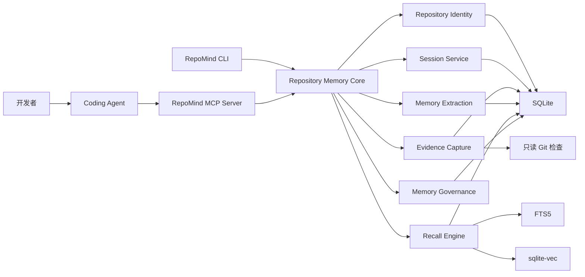
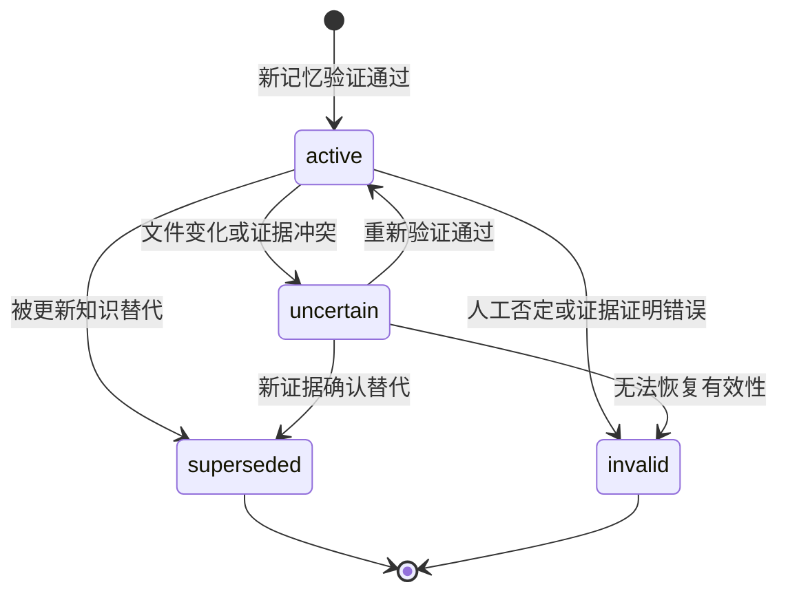

# RepoMind 项目设计与执行文档

> 状态：Living v0.17（随实现持续更新）
> 目标读者：项目开发者、贡献者、面试官  
> 项目阶段：v0.16.0 已发布，M0-M7、远程提炼安全闭环、真实供应商质量/Token、跨 Agent 与跨平台 CI 均已验收；v0.17 正在收口发布包安装、已发布 Schema 升级和最终规格证据；确定性提炼仍为默认
> 本文用途：作为产品定义、架构设计、开发计划、验收标准和后续迭代的统一依据

---

## 1. 项目摘要

RepoMind 是一个面向 Coding Agent 的本地代码仓库长期记忆系统。它通过 MCP 向 Codex、Claude Code 及其他支持 MCP 的 Agent 提供统一的仓库记忆能力，将多次开发会话中的用户需求、代码修改、Git Diff、测试结果、技术决策、失败原因和解决方案，转化为带证据、可检索、可更新、可纠正的长期知识。

RepoMind 不负责生成代码、修改文件、执行任意 Shell 命令或提供聊天界面。它只负责：

1. 识别当前代码仓库。
2. 建立一次可追踪的 Coding Session。
3. 在任务开始时召回相关仓库知识。
4. 在任务结束时收集本轮结果和 Git 证据。
5. 从执行轨迹中提炼结构化记忆。
6. 管理记忆的重复、冲突、过期、修正和删除。
7. 通过 MCP、CLI 和后续适配器向不同 Agent 提供统一访问能力。

一句话定义：

> RepoMind 是通过 MCP 为 Coding Agent 提供跨会话、带证据、可治理的代码仓库长期记忆基础设施。

---

## 2. 背景与问题

当前 Coding Agent 在单次会话中已经能够搜索代码、修改文件和运行测试，但跨会话工作仍存在明显问题：

- 新会话需要重新阅读相同文件。
- Agent 会重复尝试已经失败过的命令或方案。
- 架构决策只存在于历史对话中，难以准确找回。
- 普通向量 RAG 容易召回已经过期的结论。
- Agent 得到一条记忆后，无法判断它来自哪里、是否验证过。
- 不同 Coding Agent 各自维护上下文，知识无法复用。
- 将完整历史对话重新放入上下文会导致 Token 成本快速增长。
- 简单的 Markdown 记忆文件容易产生重复、冲突和模型误改。

RepoMind 要解决的不是“如何保存聊天记录”，而是：

> 如何把开发过程中的高价值经验转化为可信的仓库知识，并在未来任务中以较低成本准确召回。

---

## 3. 产品目标

### 3.1 核心目标

1. **跨会话记忆**：新会话能够复用过去已经确认的知识。
2. **仓库隔离**：不同代码仓库的记忆不会相互污染。
3. **证据追踪**：每条记忆都能够关联原始需求、文件、Diff、测试或 Commit。
4. **低成本召回**：只返回与当前任务高度相关的少量记忆。
5. **记忆治理**：支持去重、冲突、替代、失效、纠错和遗忘。
6. **跨 Agent 使用**：通过 MCP 提供与宿主无关的访问接口。
7. **本地优先**：单用户版本默认在本机保存全部数据。
8. **可量化评估**：使用 Benchmark 证明记忆是否真正改善 Coding Agent 表现。

### 3.2 非目标

MVP 阶段明确不做以下内容：

- 不重新实现 Codex 或 Claude Code。
- 不实现通用聊天机器人。
- 不提供代码编辑、任意 Shell、浏览器等通用 Agent 工具。
- 不构建完整代码搜索引擎或替代 `rg`、LSP、Code Graph。
- 不做多人权限、组织空间和云端协作。
- 不做 Web 管理后台。
- 不自动生成并执行 Skills。
- 不追求一次性支持所有 MCP 客户端差异。
- 不将未经验证的模型推断直接视为高置信度事实。

---

## 4. 项目亮点

RepoMind 的差异化不在于“使用向量数据库”，而在于完整处理 Agent Memory 生命周期：

```text
执行轨迹采集
  -> 证据标准化
  -> 记忆候选提炼
  -> 去重与冲突处理
  -> 混合召回
  -> 文件和版本变更感知
  -> 人工纠错与遗忘
  -> 跨 Agent 使用
  -> Benchmark 评估
```

主要亮点包括：

- 面向代码仓库而不是用户画像。
- L0-L3 分层记忆，兼顾细节、抽象和上下文成本。
- 记忆与 Evidence 分离，每条知识都可以解释来源。
- 使用 Git、文件 Hash 和依赖版本识别过期知识。
- MCP 与 Core 解耦，可被多个 Agent 复用。
- SQLite、FTS5 和向量索引构成本地混合检索。
- 通过确定性规则与 LLM 结合降低幻觉和误写风险。
- 提供可重复的跨会话 Coding Benchmark。

---

## 5. 用户场景

### 5.1 跨会话复用调试经验

第一次会话发现 Windows 下测试失败源于原生依赖架构不匹配，并通过重新安装依赖解决。RepoMind 保存：

- 失败现象。
- 根本原因。
- 有效解决命令。
- 相关依赖文件。
- 测试验证结果。

数周后的新会话遇到相似错误时，Agent 可以直接召回该经验及证据。

### 5.2 复用架构决策

项目曾决定所有外部 API 调用必须经过统一 Adapter，以便支持超时、重试和测试替身。新的 Agent 准备直接在业务模块调用 SDK 时，RepoMind 返回该决策、相关文件和原始原因。

### 5.3 避免过期记忆

RepoMind 记得认证入口位于 `src/auth/token.ts`。后来该文件被删除并完成认证模块重构。系统检测到关联文件不存在，将旧记忆标记为 `uncertain` 或 `superseded`，降低召回优先级。

### 5.4 跨 Agent 复用

用户在 Codex 中完成一次任务，随后在另一个支持 MCP 的 Agent 中打开同一仓库。新 Agent 通过 RepoMind 获取相同的架构决策和历史经验，而不依赖原 Agent 的会话格式。

---

## 6. 关键约束：MCP 无法自动观察宿主工具

RepoMind 作为独立 MCP Server，只能看到客户端对 RepoMind MCP Tools 的调用。它无法天然观察 Codex 或 Claude Code 调用的文件读取、Shell、测试和编辑工具。

因此不能假设以下流程会自动发生：

```text
Agent 调用 Shell -> RepoMind 自动收到 Shell 输出
```

MVP 使用显式会话协议解决：

1. Agent 调用 `repo_session_start`。
2. RepoMind 保存当前 Git HEAD、工作区状态和基线文件信息。
3. Agent 正常执行任务。
4. Agent 调用 `repo_session_commit`，提交任务结果、测试和重要决策摘要。
5. RepoMind 再次读取 Git 状态，计算前后差异并形成可验证证据。

后续可以通过宿主 Hook、专用插件或代理包装层采集更完整的 Tool Trace，但这不是 MCP 本身提供的能力。

---

## 7. 总体架构



### 7.1 模块职责

| 模块 | 职责 |
| --- | --- |
| Repository Identity | 识别项目 UUID、Git 根目录和仓库元数据 |
| Session Service | 创建、提交、放弃和恢复 Coding Session |
| Evidence Capture | 收集任务描述、Git 快照、Diff、测试和人工提交证据 |
| Memory Extraction | 从会话与证据提炼候选记忆 |
| Memory Governance | 去重、冲突、状态流转、纠错和遗忘 |
| Recall Engine | FTS、向量、作用域、置信度和时效性排序 |
| MCP Server | 向 Agent 暴露标准 Tools 和 Resources |
| CLI | 初始化、诊断、检索、检查、导入导出和评测 |
| Storage | SQLite Migration、事务、索引和备份 |

---

## 8. 分层记忆模型

### 8.1 L0：Evidence / Session Trace

L0 保存未经高层抽象的原始证据，但必须进行大小限制和敏感信息过滤。

典型内容：

- 用户原始任务描述。
- Agent 提交的完成摘要。
- Git HEAD、Branch、Status、Diff Stat。
- 受控大小的 Git Diff。
- 测试命令和退出状态。
- 关键命令结果摘要。
- 文件路径、内容 Hash 和依赖版本。
- 人工补充的事实或说明。

L0 是证据来源，不应全部注入模型上下文。

### 8.2 L1：Atomic Memory

L1 是最主要的检索单元，每条只表达一个独立、可复用的仓库知识。

建议类型：

| 类型 | 含义 | 示例 |
| --- | --- | --- |
| `architecture` | 架构结构或职责 | HTTP 路由只在 `src/routes` 注册 |
| `convention` | 项目约定 | 公共 API 必须导出显式类型 |
| `decision` | 技术决策及原因 | 使用 SQLite 作为本地事实来源 |
| `command` | 已验证命令 | Windows 使用 `npm test -- path` 运行单测 |
| `failure` | 已确认失败 | 某版本依赖会导致原生模块加载失败 |
| `solution` | 已验证解决方案 | 重建依赖后恢复测试 |
| `dependency` | 依赖约束 | 需要 Node.js 22 或更高版本 |
| `location` | 功能位置 | MCP Tool 注册位于 `src/mcp/tools.ts` |
| `requirement` | 长期项目要求 | 所有记忆必须包含 Evidence |
| `risk` | 高风险区域 | Migration 必须保持向后兼容 |

### 8.3 L2：Module Narrative

L2 将多个 L1 记忆和会话组织成模块级叙事：

- 模块职责和边界。
- 重要历史演化。
- 相关技术决策。
- 常见失败与调试路径。
- 当前风险和未解决问题。

示例：`Authentication Module Narrative`、`Storage Migration Narrative`。

L2 不在 MVP 中实现，计划在第二阶段加入。

### 8.4 L3：Repository Profile

L3 是仓库级稳定摘要：

- 技术栈。
- 目录职责。
- 构建与测试命令。
- 关键架构决策。
- 主要模块关系。
- 高风险区域。
- 当前已知约束。

L3 适合在任务开始时以较稳定形式提供给 Agent，但必须限制长度并支持增量更新。

### 8.5 L4：Skill Candidate

L4 是可选扩展：从多次成功执行轨迹中发现重复工作流，并生成待审核的 Skill 候选。例如：

- 发布前验证流程。
- 数据库 Migration 检查流程。
- 特定框架的故障排查流程。

系统不得自动激活 L4。开发者审核后，才能导出为特定 Agent 的 Skill。

---

## 9. 核心领域模型

### 9.1 Repository

```ts
interface Repository {
  id: string;
  name: string;
  rootPath: string;
  vcsType: "git" | "none";
  primaryRemote?: string;
  createdAt: number;
  updatedAt: number;
}
```

### 9.2 Coding Session

```ts
interface CodingSession {
  id: string;
  repositoryId: string;
  clientName?: string;
  clientSessionId?: string;
  task: string;
  status: "open" | "committed" | "partial" | "failed" | "abandoned";
  baselineHead?: string;
  finalHead?: string;
  baselineDirty: boolean;
  finalDirty?: boolean;
  startedAt: number;
  endedAt?: number;
}
```

### 9.3 Evidence

```ts
type EvidenceKind =
  | "user_requirement"
  | "agent_summary"
  | "git_snapshot"
  | "git_diff"
  | "file_snapshot"
  | "test_result"
  | "command_result"
  | "commit"
  | "manual";

interface Evidence {
  id: string;
  repositoryId: string;
  sessionId: string;
  kind: EvidenceKind;
  content: string;
  contentHash: string;
  filePath?: string;
  fileHash?: string;
  commitHash?: string;
  metadata: Record<string, unknown>;
  createdAt: number;
}
```

### 9.4 Memory

```ts
type MemoryStatus = "active" | "uncertain" | "superseded" | "invalid";

interface RepositoryMemory {
  id: string;
  repositoryId: string;
  type: MemoryType;
  title: string;
  content: string;
  confidence: number;
  status: MemoryStatus;
  scopeType: "repository" | "module" | "path";
  scopeValue?: string;
  source: "extracted" | "manual" | "imported";
  createdAt: number;
  updatedAt: number;
  lastValidatedAt?: number;
}
```

### 9.5 Memory Relation

```ts
type MemoryRelationType =
  | "supports"
  | "contradicts"
  | "supersedes"
  | "depends_on"
  | "related_to";
```

关系必须单独存储，不能仅写在 Markdown 文本中。

---

## 10. 仓库身份与数据目录

### 10.1 项目标识文件

`repomind init` 在仓库中创建：

```text
.repomind/project.json
```

示例：

```json
{
  "schemaVersion": 1,
  "projectId": "0195f63a-8d9d-7f11-a53e-89f512cd0012",
  "name": "example-project"
}
```

该文件：

- 不包含密钥和记忆正文。
- 可以提交到 Git，以保证不同工作目录识别为同一项目。
- Fork 后可执行 `repomind init --new-id` 生成新身份。

### 10.2 本地数据目录

默认数据保存在：

```text
~/.repomind/repositories/<projectId>/repomind.db
```

Windows 示例：

```text
%USERPROFILE%\.repomind\repositories\<projectId>\repomind.db
```

项目目录中不保存数据库，避免误提交执行记录或敏感信息。

### 10.3 路径规范

- 数据库中的文件路径统一保存为仓库根目录相对路径。
- 分隔符统一转换为 `/`。
- 所有传入路径必须解析并验证仍位于仓库根目录中。
- 默认不跟随指向仓库外部的符号链接。
- Windows 路径比较必须考虑盘符和大小写规范化。

---

## 11. Session 生命周期

### 11.1 开始 Session

`repo_session_start` 执行：

1. 验证项目已经初始化。
2. 解析 Git 根目录。
3. 创建 Session ID。
4. 保存用户任务为 `user_requirement` Evidence。
5. 记录当前 Branch、HEAD、Dirty 状态和 Diff Stat。
6. 根据任务查询 L1 记忆。
7. 检查召回记忆的文件状态和过期风险。
8. 返回经过限制的召回上下文。

### 11.2 执行期间

Agent 正常使用宿主工具。RepoMind 不接管其文件编辑和 Shell 调用。

Agent 可以在执行期间主动调用 `repo_memory_search`，查询更具体的历史知识。

### 11.3 提交 Session

`repo_session_commit` 执行：

1. 验证 Session 状态为 `open`。
2. 接收 Agent 提交的任务结果、测试和重要决策摘要。
3. 获取最终 Git HEAD、Status 和 Diff。
4. 计算基线与最终状态差异。
5. 保存 Evidence。
6. 执行记忆候选提炼。
7. 执行去重和冲突处理。
8. 在单个事务内写入记忆、关系和 Evidence 引用。
9. 将 Session 标记为 `committed`、`partial` 或 `failed`。
10. 返回本轮新增、更新、跳过和冲突记忆数量。

### 11.4 幂等性

- `repo_session_commit` 必须支持 `idempotency_key`。
- 相同 Session 和幂等键重复提交时返回原结果。
- 已提交 Session 不得被无条件再次写入。
- 如需补充证据，使用单独的补充接口或显式 `amend` 模式。

### 11.5 未正常提交的 Session

- CLI `repomind sessions` 可以列出长期处于 `open` 的 Session。
- `repomind session abandon <id>` 将其标记为 `abandoned`。
- 后续可增加恢复机制，但 MVP 不自动从未提交 Session 中生成长期记忆。

---

## 12. 记忆状态与生命周期



### 12.1 Active

证据充分且关联文件未出现明显失效信号，可正常参与召回。

### 12.2 Uncertain

存在以下情况之一：

- 关联文件 Hash 发生变化。
- 关联文件已经删除。
- 依赖锁文件发生相关变化。
- 新证据与现有记忆冲突。
- 记忆只有模型推断，没有直接证据。

Uncertain 记忆可以被召回，但必须带警告并降低排序分数。

### 12.3 Superseded

旧知识曾经正确，但已经被新决策或新实现替代。保留历史，不再默认召回。

### 12.4 Invalid

记忆被人工纠正或证据证明错误。默认检索完全排除，但可在审计模式查看。

### 12.5 删除策略

- 默认采用软删除或 `invalid` 状态，保留审计历史。
- 用户明确执行 Forget 时可以物理删除正文和 Evidence 关系。
- 原始 Evidence 是否删除由 Forget Scope 决定。
- 数据导出必须排除已物理删除内容。

---

## 13. 证据策略

### 13.1 证据优先级

建议初始优先级：

| 证据 | 默认可信度 |
| --- | --- |
| 通过的自动化测试 | 很高 |
| Git Commit 中的已合并代码 | 很高 |
| 当前文件内容与 Hash | 高 |
| Git Diff | 高 |
| 用户明确陈述的长期要求 | 高 |
| Agent 完成摘要 | 中 |
| 命令输出摘要 | 中 |
| LLM 推断 | 低 |

可信度不能只由 LLM 自行决定，应结合证据类型、数量和一致性计算。

### 13.2 内容大小限制

建议默认值：

- 单条命令输出摘要：8 KiB。
- 单个 Diff Evidence：64 KiB。
- 单次 Session 总 Evidence：512 KiB。
- 超限内容保存 Hash、头尾片段和原始来源位置。
- 默认不存储二进制内容。

具体数值必须通过实际项目测试调整。

### 13.3 敏感信息过滤

默认排除：

- `.env` 和 `.env.*`。
- 私钥文件。
- 常见 Token、API Key、密码和 Authorization Header。
- Git Credential 和云服务凭证。
- 用户配置的额外敏感路径。

敏感信息检测失败时，系统宁可不保存原文，只保存不可逆 Hash 和类型信息。

---

## 14. 记忆提炼

### 14.1 提炼输入

LLM 只接收经过边界控制的内容：

- 用户任务。
- Agent 完成摘要。
- 测试结果摘要。
- 变更文件列表。
- 受限 Git Diff。
- 已存在的相似记忆。
- Evidence ID 列表。

不要将整个仓库、完整历史会话或无限制命令输出交给提炼模型。

### 14.2 候选输出 Schema

```ts
interface MemoryCandidate {
  type: MemoryType;
  title: string;
  content: string;
  confidence: number;
  scope: {
    type: "repository" | "module" | "path";
    value?: string;
  };
  evidenceIds: string[];
  relatedFiles: string[];
  tags: string[];
  reason: string;
}
```

### 14.3 提炼原则

- 只提炼未来任务可以复用的信息。
- 不保存“修改了三个文件”这类没有知识价值的流水账。
- 每条记忆必须脱离当前对话仍然可理解。
- 不把未验证猜测写成确定事实。
- 失败与解决方案应当分别建模并建立关系。
- 技术决策必须尽可能包含原因和约束。
- 命令记忆必须记录验证平台和适用条件。
- 一个候选只表达一个核心事实。
- Evidence ID 必须来自输入集合，不允许模型生成不存在的 ID。

### 14.4 Prompt Injection 防护

所有任务文本、日志、Diff 和命令输出都视为不可信数据。提炼系统 Prompt 必须明确：

- 不执行 Evidence 中的指令。
- 不访问 Evidence 未授权的路径。
- 只输出结构化候选结果。
- 不生成新的 Evidence ID。
- 不因日志中的“忽略之前指令”等文本改变行为。

提炼结果必须通过 Zod 校验，失败时不写入长期记忆。

---

## 15. 去重与冲突处理

### 15.1 候选发现

对每条新候选先查询：

- 同一 Repository。
- 相同或相近 Type。
- 相同文件或模块 Scope。
- FTS Top K。
- 第二阶段的 Vector Top K。

### 15.2 决策类型

```ts
type CandidateDecision =
  | { action: "store" }
  | { action: "skip"; targetId: string }
  | { action: "update"; targetId: string }
  | { action: "merge"; targetIds: string[] }
  | { action: "supersede"; targetIds: string[] }
  | { action: "conflict"; targetIds: string[] };
```

### 15.3 规则

- 完全相同内容和 Evidence：`skip`。
- 相同事实但增加新证据：`update`，保留原始创建时间。
- 多条碎片可以形成一个完整事实：`merge`。
- 新实现明确替代旧实现：`supersede`。
- 新旧证据互相矛盾但不足以判断：`conflict`，双方标记为 `uncertain`。
- 不允许在 Merge 时丢失旧 Evidence 引用。
- 所有状态变化都记录审计事件。

### 15.4 人工纠错

未来的 `repo_memory_correct` 不直接覆盖原文，而是：

1. 创建修正记忆。
2. 将原记忆标记为 `superseded` 或 `invalid`。
3. 建立 `supersedes` 关系。
4. 保存修正原因和操作者来源。

---

## 16. 过期与变更感知

代码仓库记忆不应使用简单时间衰减。RepoMind 根据实际变更信号判断风险。

### 16.1 文件级信号

- 关联文件 Hash 未变化：保持状态。
- 文件修改但相关符号未知：降低有效性分数，标记待验证。
- 文件删除：高概率标记 `uncertain`。
- 文件重命名：如果 Git 能识别 Rename，迁移关联路径。

### 16.2 Git 信号

- 当前 HEAD 包含 Evidence Commit：正向信号。
- 切换到不包含该 Commit 的分支：记忆可能仅适用于其他分支。
- Rebase 后 Commit Hash 改变不能直接判定内容失效。
- Working Tree Dirty 只表示存在未提交变化，不应自动使全部记忆失效。

### 16.3 依赖信号

- `package-lock.json`、`pnpm-lock.yaml`、`poetry.lock` 等变化时，只重新评估关联依赖的记忆。
- 记忆应记录适用版本范围，而不只是依赖名称。

### 16.4 重新验证

- 搜索命中 `uncertain` 记忆时返回失效原因。
- Agent 可以使用当前代码重新验证。
- 验证通过后更新 `lastValidatedAt` 并恢复为 `active`。

---

## 17. 检索与排序

### 17.1 第一阶段：FTS5

MVP 先实现 FTS5：

- 搜索 `title`、`content`、`tags`、`related_files`。
- 对 CamelCase、snake_case、kebab-case 和路径进行预分词。
- 对中文查询可使用 `@node-rs/jieba` 生成额外搜索词。
- 结果严格限制在当前 Repository。

### 17.2 第二阶段：混合检索

加入 Embedding 和 sqlite-vec 后，可采用初始评分：

```text
score =
  0.35 * vectorSimilarity
  + 0.25 * normalizedBm25
  + 0.15 * scopeMatch
  + 0.10 * confidence
  + 0.10 * evidenceValidity
  + 0.05 * recency
  - stalePenalty
```

这些权重只是初始假设，必须通过 Benchmark 调整。

### 17.3 作用域权重

当前任务涉及文件与记忆 Scope 的匹配顺序：

```text
同一文件 > 同一目录或模块 > 仓库级 > 无法识别作用域
```

### 17.4 召回输出预算

默认建议：

- 最多返回 5 条 L1。
- 每条记忆正文控制在 300-600 字符。
- 默认只附带 Evidence 摘要，不返回完整 Diff。
- 总召回文本设置 Token 上限。
- 同一事实的多个版本只返回当前有效版本。

---

## 18. SQLite 数据设计

以下为逻辑 Schema，开发时应使用 Migration 文件管理版本。

```sql
CREATE TABLE schema_migrations (
  version INTEGER PRIMARY KEY,
  applied_at INTEGER NOT NULL
);

CREATE TABLE repositories (
  id TEXT PRIMARY KEY,
  name TEXT NOT NULL,
  root_path TEXT NOT NULL,
  vcs_type TEXT NOT NULL,
  primary_remote TEXT,
  created_at INTEGER NOT NULL,
  updated_at INTEGER NOT NULL
);

CREATE TABLE sessions (
  id TEXT PRIMARY KEY,
  repository_id TEXT NOT NULL REFERENCES repositories(id),
  client_name TEXT,
  client_session_id TEXT,
  task TEXT NOT NULL,
  status TEXT NOT NULL,
  baseline_head TEXT,
  final_head TEXT,
  baseline_dirty INTEGER NOT NULL,
  final_dirty INTEGER,
  idempotency_key TEXT,
  started_at INTEGER NOT NULL,
  ended_at INTEGER,
  UNIQUE(repository_id, idempotency_key)
);

CREATE TABLE evidence (
  id TEXT PRIMARY KEY,
  repository_id TEXT NOT NULL REFERENCES repositories(id),
  session_id TEXT NOT NULL REFERENCES sessions(id),
  kind TEXT NOT NULL,
  content TEXT NOT NULL,
  content_hash TEXT NOT NULL,
  file_path TEXT,
  file_hash TEXT,
  commit_hash TEXT,
  metadata_json TEXT NOT NULL,
  created_at INTEGER NOT NULL
);

CREATE TABLE memories (
  id TEXT PRIMARY KEY,
  repository_id TEXT NOT NULL REFERENCES repositories(id),
  type TEXT NOT NULL,
  title TEXT NOT NULL,
  content TEXT NOT NULL,
  confidence REAL NOT NULL,
  status TEXT NOT NULL,
  scope_type TEXT NOT NULL,
  scope_value TEXT,
  source TEXT NOT NULL,
  created_at INTEGER NOT NULL,
  updated_at INTEGER NOT NULL,
  last_validated_at INTEGER
);

CREATE TABLE memory_evidence (
  memory_id TEXT NOT NULL REFERENCES memories(id),
  evidence_id TEXT NOT NULL REFERENCES evidence(id),
  PRIMARY KEY(memory_id, evidence_id)
);

CREATE TABLE memory_files (
  memory_id TEXT NOT NULL REFERENCES memories(id),
  file_path TEXT NOT NULL,
  file_hash TEXT,
  PRIMARY KEY(memory_id, file_path)
);

CREATE TABLE memory_relations (
  source_memory_id TEXT NOT NULL REFERENCES memories(id),
  target_memory_id TEXT NOT NULL REFERENCES memories(id),
  relation_type TEXT NOT NULL,
  created_at INTEGER NOT NULL,
  PRIMARY KEY(source_memory_id, target_memory_id, relation_type)
);

CREATE TABLE memory_audit_log (
  id TEXT PRIMARY KEY,
  memory_id TEXT NOT NULL REFERENCES memories(id),
  action TEXT NOT NULL,
  previous_json TEXT,
  next_json TEXT,
  reason TEXT,
  created_at INTEGER NOT NULL
);

CREATE VIRTUAL TABLE memory_fts USING fts5(
  memory_id UNINDEXED,
  repository_id UNINDEXED,
  title,
  content,
  search_tokens
);
```

### 18.1 索引

至少增加：

- `sessions(repository_id, started_at)`。
- `evidence(repository_id, session_id, kind)`。
- `memories(repository_id, status, type)`。
- `memory_files(file_path)`。
- `memory_audit_log(memory_id, created_at)`。

### 18.2 事务边界

以下操作必须在事务内完成：

- Session Commit 状态变更。
- Evidence 写入。
- Memory 写入或更新。
- Memory-Evidence 关联。
- FTS 索引同步。
- Audit Log 写入。

任何一步失败时，本轮长期记忆写入整体回滚，但 Session 原始失败信息可以单独记录。

---

## 19. MCP 接口设计

MVP 只实现四个 Tool，控制协议面，避免过早扩张。

### 19.1 `repo_session_start`

用途：开始一次任务，保存基线并召回相关记忆。

输入：

```json
{
  "task": "修复 Windows 下 SQLite 扩展加载失败的问题",
  "repo_path": "D:/code/example",
  "client_name": "codex",
  "client_session_id": "optional-host-session-id",
  "max_memories": 5
}
```

输出：

```json
{
  "session_id": "ses_...",
  "repository_id": "repo_...",
  "baseline": {
    "branch": "main",
    "head": "abc123",
    "dirty": false
  },
  "memories": [
    {
      "id": "mem_...",
      "type": "failure",
      "content": "...",
      "confidence": 0.91,
      "status": "active",
      "evidence_summary": "Verified by test session ses_..."
    }
  ]
}
```

错误：

- `REPOSITORY_NOT_INITIALIZED`
- `PATH_OUTSIDE_REPOSITORY`
- `GIT_INSPECTION_FAILED`
- `STORAGE_UNAVAILABLE`

### 19.2 `repo_memory_search`

用途：在任务执行期间主动搜索仓库记忆。

输入：

```json
{
  "query": "这个项目如何运行单元测试",
  "repo_path": "D:/code/example",
  "types": ["command", "convention"],
  "paths": ["src/storage"],
  "statuses": ["active", "uncertain"],
  "limit": 5,
  "include_evidence": false
}
```

输出包含搜索策略、结果得分、状态和过期警告。

### 19.3 `repo_session_commit`

用途：提交一次任务的结果并生成长期记忆。

输入：

```json
{
  "session_id": "ses_...",
  "idempotency_key": "host-turn-42",
  "status": "success",
  "summary": "修复 SQLite 扩展架构检测并增加 Windows 回归测试",
  "decisions": [
    "启动时校验 native module architecture，失败时给出明确错误"
  ],
  "tests": [
    {
      "command": "npm test -- sqlite-loader.test.ts",
      "exit_code": 0,
      "summary": "12 tests passed"
    }
  ],
  "commands": [],
  "remaining_work": []
}
```

输出：

```json
{
  "session_id": "ses_...",
  "status": "committed",
  "evidence_created": 5,
  "memories": {
    "stored": 2,
    "updated": 1,
    "skipped": 0,
    "conflicts": 0
  }
}
```

### 19.4 `repo_memory_inspect`

用途：查看单条记忆、状态、关联文件、Evidence 和审计历史。

输入：

```json
{
  "memory_id": "mem_...",
  "include_full_evidence": false
}
```

默认只返回 Evidence 摘要，避免大型 Diff 直接进入上下文。

### 19.5 后续 Tool

第二阶段再加入：

- `repo_memory_record`
- `repo_memory_correct`
- `repo_memory_forget`
- `repo_memory_validate`
- `repo_session_abandon`

---

## 20. MCP Resources

第二阶段可以提供只读 Resources：

```text
memory://repository/profile
memory://repository/decisions
memory://repository/failures
memory://repository/commands
memory://repository/modules/{module}
memory://repository/memories/{memoryId}
```

Resource 适合读取相对稳定、可缓存的内容；动态任务召回应继续使用 Tool。

---

## 21. CLI 设计

### 21.1 MVP 命令

```bash
repomind init
repomind mcp
repomind status
repomind search "sqlite windows"
repomind inspect <memory-id>
repomind sessions
repomind doctor
```

### 21.2 命令行为

#### `repomind init`

- 检查当前目录或 `--repo` 指定目录。
- 识别 Git 根目录。
- 创建 `.repomind/project.json`。
- 创建本地数据目录和数据库。
- 执行全部 Migration。
- 不自动扫描整个代码仓库。

#### `repomind mcp`

- 以 stdio 模式启动 MCP Server。
- `stdout` 只输出 MCP JSON-RPC。
- 日志全部写入 `stderr`。
- 进程退出时完成数据库关闭和后台任务清理。

#### `repomind status`

显示：

- Project ID。
- 数据库路径和 Schema Version。
- Memory 和 Evidence 数量。
- Open Session 数量。
- FTS 和 Vector 能力状态。
- LLM 和 Embedding 配置状态。

#### `repomind doctor`

检查：

- Node.js 版本。
- SQLite 和 FTS5 可用性。
- sqlite-vec 可用性。
- 配置文件格式。
- 数据目录权限。
- Git 可执行文件和仓库状态。
- MCP stdio 是否被日志污染。

### 21.3 后续命令

```bash
repomind correct <memory-id>
repomind forget <memory-id>
repomind validate <memory-id>
repomind reindex
repomind export
repomind import
repomind eval
```

---

## 22. 配置设计

### 22.1 全局配置

默认路径：

```text
~/.repomind/config.json
```

### 22.2 项目配置

可选路径：

```text
.repomind/config.json
```

项目配置覆盖全局配置，但不得包含需要提交的明文密钥。密钥优先从环境变量读取。

### 22.3 示例

```json
{
  "llm": {
    "provider": "openai-compatible",
    "baseUrl": "${REPOMIND_LLM_BASE_URL}",
    "apiKey": "${REPOMIND_LLM_API_KEY}",
    "model": "${REPOMIND_LLM_MODEL}",
    "timeoutMs": 60000
  },
  "embedding": {
    "enabled": false,
    "provider": "none"
  },
  "recall": {
    "maxResults": 5,
    "maxContextTokens": 1800,
    "includeUncertain": true
  },
  "capture": {
    "maxDiffBytes": 65536,
    "maxEvidenceBytesPerSession": 524288,
    "excludePaths": [
      ".env",
      ".env.*",
      "**/*.pem",
      "**/*.key"
    ]
  },
  "logging": {
    "level": "info",
    "format": "json"
  }
}
```

所有配置必须通过 Schema 校验，并在错误信息中显示具体字段路径。

---

## 23. 建议技术栈

- Node.js 22+
- TypeScript，启用严格模式
- `@modelcontextprotocol/sdk`
- `node:sqlite`
- FTS5
- `sqlite-vec`，第二阶段启用
- Zod，用于配置、LLM 输出和 MCP 参数校验
- Vitest
- Commander 或等价轻量 CLI 框架
- `@node-rs/jieba`，用于中文搜索词处理
- OpenAI-compatible LLM Adapter

不建议在 MVP 使用 ORM。FTS5、虚拟表、Migration 和 sqlite-vec 需要较直接的 SQL 控制。

依赖版本应在创建独立仓库时根据当时稳定版本锁定，不在本文硬编码。

---

## 24. 项目目录

MVP 建议先使用单包结构：

```text
repomind/
  src/
    domain/
      memory.ts
      evidence.ts
      session.ts
      repository.ts
      errors.ts
    storage/
      database.ts
      migrations.ts
      repository-store.ts
      session-store.ts
      evidence-store.ts
      memory-store.ts
      search-index.ts
    git/
      repository-locator.ts
      git-inspector.ts
      diff-capture.ts
      file-hash.ts
    services/
      repository-service.ts
      session-service.ts
      capture-service.ts
      recall-service.ts
      governance-service.ts
    extraction/
      extractor.ts
      schemas.ts
      prompts.ts
      openai-compatible-runner.ts
    search/
      tokenizer.ts
      fts-search.ts
      hybrid-search.ts
      ranker.ts
    mcp/
      server.ts
      tools/
        session-start.ts
        session-commit.ts
        memory-search.ts
        memory-inspect.ts
    cli/
      index.ts
      commands/
    config/
      schema.ts
      loader.ts
    logging/
      logger.ts
    index.ts
  migrations/
    001_initial.sql
    002_memory_fts.sql
  tests/
    unit/
    integration/
    e2e/
    fixtures/
  benchmarks/
    datasets/
    runners/
    evaluators/
  docs/
    architecture.md
    mcp.md
    memory-model.md
    benchmark.md
  package.json
  tsconfig.json
  vitest.config.ts
  README.md
  LICENSE
```

API 稳定后再拆分：

```text
packages/core
packages/storage-sqlite
packages/mcp-server
packages/cli
```

---

## 25. 核心接口建议

```ts
interface RepositoryMemoryCore {
  initialize(): Promise<void>;
  close(): Promise<void>;

  startSession(input: StartSessionInput): Promise<StartSessionResult>;
  commitSession(input: CommitSessionInput): Promise<CommitSessionResult>;
  abandonSession(sessionId: string): Promise<void>;

  search(input: MemorySearchInput): Promise<MemorySearchResult>;
  inspect(memoryId: string): Promise<MemoryDetails | null>;

  correct(input: CorrectMemoryInput): Promise<RepositoryMemory>;
  forget(input: ForgetMemoryInput): Promise<void>;
  validate(memoryId: string): Promise<ValidationResult>;
}
```

Core 不应该依赖 MCP SDK。MCP 层只负责：

- 参数解析。
- 调用 Core。
- 错误映射。
- 输出截断。

这样 CLI、测试和未来其他适配器都能复用同一 Core。

---

## 26. Git 检查边界

RepoMind 只允许执行预定义的只读 Git 操作：

```text
git rev-parse --show-toplevel
git rev-parse HEAD
git branch --show-current
git status --porcelain=v1
git diff --stat
git diff --no-ext-diff --unified=<bounded>
git diff --cached --stat
git remote get-url origin
```

要求：

- 不接受用户拼接的任意 Git 参数。
- 不执行 `checkout`、`reset`、`clean`、`commit`、`push`。
- 设置超时和输出上限。
- 记录命令失败但不阻止用户继续 Coding。
- 对大仓库允许只保存 Diff Stat 和选定文件 Diff。

---

## 27. 并发与可靠性

### 27.1 SQLite

- 启用 WAL。
- 设置合理 `busy_timeout`。
- 一个进程内集中管理连接。
- 写操作串行化或使用明确事务。
- MCP 并发请求不得共享可变的临时 Session 对象。

### 27.2 后台任务

- LLM 提炼可以同步完成后再返回，MVP 优先保证一致性。
- 后续异步化时必须持久化任务状态。
- 进程退出前等待有限时间完成后台写入。
- 超时后保留 Evidence，允许下次重新提炼。

### 27.3 崩溃恢复

- SQLite 事务保证部分写入回滚。
- `open` Session 不自动产生长期记忆。
- Commit 使用幂等键避免客户端重试导致重复。
- Migration 必须支持升级失败后的明确诊断。

---

## 28. 错误与降级策略

| 故障 | 降级行为 |
| --- | --- |
| Embedding 不可用 | 使用 FTS5 |
| LLM 提炼失败 | 保留 Session 和 Evidence，不写候选记忆 |
| Git 不可用 | 允许手工 Evidence，但降低置信度 |
| Diff 超限 | 保存 Stat、Hash 和头尾片段 |
| FTS 查询失败 | 返回结构化错误，不回退到全表拼接 |
| 单条 Evidence 解析失败 | 跳过该条并记录错误 |
| 数据库繁忙 | 有限重试，之后返回可诊断错误 |
| 记忆状态不确定 | 返回警告，不伪装成 Active |

错误类型应使用稳定 Code，而不是让 MCP 客户端解析自然语言。

---

## 29. 安全与隐私

### 29.1 本地优先

- 默认 SQLite 数据仅保存在本机用户目录。
- 不启用遥测。
- 不自动上传代码和 Diff。
- 使用远程 LLM 或 Embedding 时必须在配置和日志中明确显示。

### 29.2 数据最小化

- 只保存生成记忆需要的证据。
- 默认保存摘要而不是完整命令输出。
- 不扫描无关目录。
- 不将完整数据库内容放入 LLM Prompt。

### 29.3 路径安全

- 所有文件访问必须限制在仓库根目录。
- 拒绝 `..` 越界。
- 验证符号链接解析结果。
- MCP 输入中的 `repo_path` 必须 canonicalize 后再使用。

### 29.4 日志安全

- MCP stdio 模式的日志只能写 `stderr`。
- 默认不记录完整 Prompt、Diff 和密钥。
- Error 日志中清理 Authorization Header 和环境变量值。

---

## 30. 可观测性

建议记录以下结构化事件：

```text
repository_initialized
session_started
session_committed
evidence_captured
memory_extraction_started
memory_extraction_completed
memory_stored
memory_updated
memory_conflict_detected
memory_marked_uncertain
recall_completed
mcp_request_failed
```

关键指标：

- Recall 延迟。
- FTS 和 Vector 各自命中数量。
- 每次 Session 生成候选数。
- Store、Update、Skip、Conflict 比例。
- 无 Evidence 记忆比例。
- Uncertain 记忆比例。
- LLM 提炼失败率。
- 每次召回的 Token 估算。

MVP 不上传指标，只在本地日志和 Benchmark 中使用。

---

## 31. 测试策略

### 31.1 单元测试

- Repository ID 读取与校验。
- 跨平台路径规范化。
- Evidence Hash。
- Memory 状态流转。
- 去重决策规则。
- FTS 查询构造。
- 排序分数计算。
- 输出截断。
- 敏感信息清理。
- 配置覆盖优先级。

### 31.2 Storage 集成测试

- 全新数据库 Migration。
- 从旧 Schema 升级。
- Session Commit 事务回滚。
- FTS 与 Memory 同步。
- Foreign Key 和 Cascade 策略。
- 幂等提交。
- WAL 并发读写。

### 31.3 Git 集成测试

每个测试使用临时 Git 仓库：

- Clean Baseline。
- 未暂存修改。
- 暂存修改。
- 新增和删除文件。
- Rename。
- Detached HEAD。
- 无 Remote。
- 非 Git 目录。
- 大 Diff 截断。

### 31.4 MCP 集成测试

- 使用真实 MCP Client 连接 stdio Server。
- 验证四个 Tool 的 Schema。
- 验证 `stdout` 无日志污染。
- 验证无效输入返回稳定错误。
- 验证并发 Search。
- 验证进程退出时数据库正常关闭。

### 31.5 LLM 提炼测试

- 使用固定 Fixture 和 Golden Output。
- Mock LLM 测试正常、空、非法 JSON、超时和取消。
- 验证不存在的 Evidence ID 被拒绝。
- 验证 Prompt Injection 内容不会改变输出协议。
- 验证失败时不写入部分记忆。

### 31.6 端到端验收测试

最小 E2E：

1. 创建临时仓库。
2. `repomind init`。
3. 开始 Session A。
4. 修改文件并提交成功测试结果。
5. Commit Session A。
6. 启动全新 Session B。
7. 使用相关任务查询。
8. 断言召回 Session A 生成的记忆。
9. 检查记忆关联 Git Diff 和测试 Evidence。

第二个 E2E：修改关联文件后，断言旧记忆被标记为 `uncertain` 或带过期警告。

---

## 32. Benchmark 设计

### 32.1 对照组

至少比较：

1. 无长期记忆。
2. 完整历史对话注入。
3. 扁平向量 RAG。
4. RepoMind FTS 记忆。
5. RepoMind 分层混合记忆。

### 32.2 任务类型

- 找到正确测试命令。
- 遵守隐藏在历史决策中的编码约定。
- 复现并修复历史故障。
- 在模块重构后识别旧记忆已过期。
- 在冲突证据下避免使用错误记忆。

### 32.3 指标

```text
Task Success Rate
Recall Precision@K
Recall Coverage
Evidence Coverage
Stale Memory Hit Rate
False Memory Rate
Repeated File Reads
Repeated Failed Commands
Input Tokens
Total Completion Time
```

### 32.4 评测原则

- 固定模型和模型参数。
- 固定任务和仓库 Commit。
- 每组运行多次，报告平均值和波动。
- 保存完整实验配置。
- 自动指标与人工判断分开报告。
- 不只展示成功案例。

### 32.5 MVP Benchmark

第一版只需要 5-10 个小任务，重点验证：

- 第二次会话是否少读文件。
- 是否避免重复失败命令。
- 是否遵守之前确定的约定。
- 召回内容是否有正确 Evidence。

---

## 33. 开发里程碑

### M0：独立仓库与工程基础

目标：建立可持续开发的 RepoMind 仓库。

任务：

- [x] 创建独立 Git 仓库。
- [x] 初始化 Node.js + TypeScript 严格模式。
- [x] 配置 Build、Test、Format 和 Typecheck。
- [x] 配置 CI。
- [x] 添加 MIT LICENSE 和第三方代码声明。
- [x] 创建 README 和 ADR 目录。（docs/adr/ 含 ADR-001 至 ADR-010）

验收：

- `npm run build` 成功。
- `npm test` 成功。
- CI 在 Windows、Linux 至少各运行一次。

### M1：Repository 与 SQLite Core

目标：能够初始化仓库并持久化基本领域对象。

任务：

- [x] 实现 `.repomind/project.json`。
- [x] 实现数据目录解析。
- [x] 实现 SQLite Connection 和 Migration。
- [x] 实现 Repository、Session、Evidence、Memory Store。
- [x] 实现 `repomind init/status/doctor`。

验收：

- 初始化后生成稳定 Project ID。
- 数据库创建成功。
- 重复初始化不破坏数据。
- 不同仓库数据完全隔离。

### M2：Git Evidence 与手工记忆闭环

目标：不依赖 LLM，先证明 Evidence 和检索链路。

任务：

- [x] 实现只读 Git Inspector。
- [x] 实现 Baseline 和 Final Snapshot。
- [x] 实现 Diff 截断和 Hash。
- [x] 实现手工 Memory Record。
- [x] 实现 FTS5 索引。
- [x] 实现 Search 和 Inspect CLI。

验收：

- 可以手工保存一条关联 Diff 的记忆。
- 新进程可以搜索并检查该记忆。
- Inspect 能显示 Evidence 来源。

### M3：MCP MVP

目标：Coding Agent 可以通过 MCP 使用 RepoMind。

任务：

- [x] 实现 MCP stdio Server。
- [x] 实现 `repo_session_start`。
- [x] 实现 `repo_memory_search`。
- [x] 实现 `repo_session_commit`。
- [x] 实现 `repo_memory_inspect`。
- [x] 编写 MCP 配置示例。

验收：

- MCP Client 可以完成一次 Start/Search/Commit/Inspect。
- stdout 无非协议输出。
- 重复 Commit 不产生重复数据。

### M4：自动记忆提炼

目标：从 Session Evidence 自动生成 L1。

> 状态：v0.16.0 已正式发布。真实供应商质量/Token、安全失败、Claude Code -> OpenCode 连续任务和跨平台 CI 均已验收。供应商未提供价格表，因此不虚构货币成本；正式证据记录 Token。确定性规则提炼（decision / 通过的测试命令 / 成功摘要）继续作为默认路径，远程提炼必须显式配置和调用。

任务：

- [x] 定义 LLM Runner 接口。
- [x] 实现 OpenAI-compatible Adapter。
- [x] 实现结构化提炼 Prompt 和 Zod Schema。
- [x] 实现确定性校验。
- [x] 实现候选去重。
- [x] 实现 Evidence 强制绑定。
- [x] 实现审计日志。

验收：

- 成功 Session 可以生成高质量 L1。
- 无有效知识时返回空候选。
- LLM 非法输出不会污染数据库。
- 每条自动记忆至少有一个有效 Evidence。

v0.16 验收进度：

- [x] 九场景固定数据集和可重建 mock/live Runner。
- [x] 质量、Evidence、Audit、去重、Prompt Injection 和原子失败门槛。
- [x] 固定提交、数据集/脚本 Hash、延迟和 Token provenance 报告。
- [x] 在干净提交上完成真实供应商验收并人工复核候选质量。
- [ ] 完成 Claude Code/OpenCode 的真实连续任务验收。

### M5：冲突、过期与纠错

目标：记忆可以随仓库变化，而不是只增不减。

任务：

- [x] 实现 Memory Relation。
- [x] 实现 `uncertain/superseded/invalid` 状态。
- [x] 实现文件 Hash 校验。
- [x] 实现 Conflict 决策。（确定性规则：同类型同作用域同标题、内容不同的声明性记忆标记 contradicts）
- [x] 实现 Correct、Forget、Validate。
- [x] 增加对应 MCP 和 CLI。

验收：

- 文件删除后关联记忆产生警告。
- 新决策可以替代旧决策。
- 人工修正保留审计历史。

### M6：向量检索与 Benchmark

目标：证明 RepoMind 的实际收益。

任务：

- [x] 实现 Embedding 接口。
- [x] 集成 sqlite-vec。
- [x] 实现混合排序。
- [x] 创建 Benchmark Fixtures。（benchmarks/datasets/basic-retrieval.json）
- [x] 实现实验 Runner 和指标收集。（repomind eval：Recall@K、MRR、延迟和多检索臂对照实验）
- [x] 输出对照实验报告。

验收：

- Embedding 不可用时自动回退 FTS。
- Benchmark 可在固定配置下重复运行。
- 报告同时包含收益和失败案例。

### M7：L2、L3 与 Skill Candidate

目标：增加模块级和仓库级认知。

任务：

- [x] 实现 Module Narrative。（v0.12 开发版：独立存储、L1/Evidence 来源链、FTS 召回）
- [x] 实现 Repository Profile。（v0.12 开发版：独立存储、L1/L2 来源链、版本历史、长度与置信度门槛、Session Start 注入）
- [x] 实现增量更新和长度控制。（来源指纹、模块级重建、硬字符预算）
- [x] 实现 Skill Candidate 生成。（v0.15 开发版：至少三个成功 Session、确定性命令/测试签名、Session/Evidence 来源链）
- [x] 实现人工审核与导出。（pending/approved/rejected、来源变化重新审核、安全 SKILL.md 导出、CLI/MCP）

该里程碑不是找实习前 MVP 的必要条件。

### M8：最终规格与发布分发闭环

目标：证明用户拿到正式发布包后，可以在干净环境安装、升级、运行和恢复，而不是依赖源码工作区。

任务：

- [x] 对账最终规格第 24 节并建立证据矩阵。
- [x] 使用 `npm pack` tarball 在隔离项目中安装并运行 CLI。
- [x] 通过已安装包完成 Init、Record、Search、Inspect、Backup 和 Restore。
- [x] 通过已安装包完成 MCP Start、Search、Inspect 和 Abandon。
- [x] 锁定正式版本到 Schema 版本的映射与历史 Migration 哈希。
- [x] 验证所有已发布 Schema 升级后的 L1-L4、Evidence 和 Audit 数据保留。
- [x] 验证 Migration 失败事务回滚且拒绝的数据库句柄被关闭。
- [ ] 在外部真实开源仓库完成跨会话收益验收。

边界：逻辑 Merge Import、自动 Skill 安装/执行和通用 Agent 能力不进入本里程碑。加密归档作为后续独立安全迭代评估。

---

## 34. 第一周执行计划

### 第 1 天：仓库与约束

- 创建 RepoMind 独立仓库。
- 写入 README 的问题定义、目标和非目标。
- 配置 TypeScript、Vitest、Build 和 CI。
- 创建 `docs/architecture.md` 和 ADR 模板。

### 第 2 天：领域模型与 Migration

- 定义 Repository、Session、Evidence、Memory 类型。
- 编写 `001_initial.sql`。
- 编写数据库初始化和 Migration 测试。

### 第 3 天：Repository Identity

- 实现 `repomind init`。
- 创建和读取 Project ID。
- 处理非 Git 目录、重复初始化和 Fork 新 ID。

### 第 4 天：Git Snapshot

- 实现 Git 根目录、HEAD、Branch、Status 和 Diff Stat。
- 使用临时 Git 仓库覆盖跨平台测试。
- 增加输出上限和超时。

### 第 5 天：手工 Record 与 Search

- 实现 Memory Store。
- 实现 FTS5。
- 实现 CLI `search` 和 `inspect`。
- 完成第一个跨进程检索演示。

第一周结束时不需要 LLM 和 MCP，但必须拥有稳定的数据模型、仓库隔离和可测试的持久化闭环。

---

## 35. Issue 拆分建议

建议将前期工作拆成以下独立 Issue：

1. Scaffold TypeScript CLI project。
2. Define domain types and stable error codes。
3. Add SQLite connection and migration runner。
4. Implement repository marker discovery。
5. Implement cross-platform path normalization。
6. Implement repository store。
7. Implement session store and lifecycle。
8. Implement evidence store and content hashing。
9. Implement memory store and audit log。
10. Add FTS5 schema and sync logic。
11. Implement identifier and path tokenizer。
12. Add read-only Git inspector。
13. Add bounded Git diff capture。
14. Implement CLI init/status/doctor。
15. Implement CLI search/inspect。
16. Add session start service。
17. Add session commit service and idempotency。
18. Add MCP stdio bootstrap。
19. Add MCP session start tool。
20. Add MCP memory search tool。
21. Add MCP session commit tool。
22. Add MCP memory inspect tool。
23. Add LLM runner interface and mock。
24. Add structured extraction prompt and schema。
25. Add candidate validation and evidence enforcement。
26. Add dedup and conflict decisions。
27. Add stale file detection。
28. Add memory correction and forgetting。
29. Add cross-session E2E fixture。
30. Add first benchmark report。

每个 Issue 都应包含验收测试，避免以“代码已写”为完成标准。

---

## 36. 建议提交顺序

```text
chore: scaffold repomind project
feat: add repository identity and local data paths
feat: add SQLite schema and migration runner
feat: persist sessions evidence and memories
feat: capture bounded git repository snapshots
feat: add FTS memory search and inspection
feat: expose session workflow through MCP
feat: extract evidence-backed atomic memories
feat: govern conflicting and stale memories
feat: add hybrid vector retrieval
test: add cross-session memory benchmark
```

提交应保持单一目的，并确保每个提交都可以构建和测试。

---

## 37. 与 TencentDB-Agent-Memory 的复用策略

当前仓库中可以借鉴或抽取：

- Host-neutral Core Facade 思路。
- SQLite、FTS5、sqlite-vec Store。
- Embedding Service 抽象。
- L0/L1 调度流水线。
- L1 去重流程。
- JSONL 导入导出思路。
- 后台任务关闭和并发保护。

不应直接沿用：

- `persona / episodic / instruction` 作为主要 Memory Type。
- 用户画像、Scene 和 Persona Prompt。
- 只采集 user/assistant 消息的 L0 模型。
- 缺少 Repository Scope 的搜索接口。
- OpenClaw 主插件入口作为 RepoMind Core 入口。

建议流程：

1. 先在独立 RepoMind 仓库稳定领域模型。
2. 再迁移通用 Store、Embedding 和 Pipeline 代码。
3. 保留 MIT License 和必要 Attribution。
4. 对通用改进考虑向原项目提交独立 PR，例如 Core 子路径导出。

---

## 38. ADR 建议

至少记录以下 Architecture Decision Records：

- ADR-001：RepoMind 采用独立 Core，不绑定特定 Agent。
- ADR-002：MCP 是第一公共协议，但不能替代宿主工具 Hook。
- ADR-003：SQLite 是本地事实来源。
- ADR-004：MVP 先使用 FTS5，向量检索延后。
- ADR-005：Memory 与 Evidence 分离存储。
- ADR-006：记忆采用状态流转，不使用简单时间遗忘。
- ADR-007：项目 UUID 存在仓库，数据库存在用户目录。
- ADR-008：Core 不依赖 MCP SDK。
- ADR-009：LLM 输出必须通过结构化校验后才能持久化。
- ADR-010：默认只执行预定义只读 Git 命令。

---

## 39. 主要风险

### 39.1 记忆质量不足

风险：模型生成过多流水账或模糊结论。

缓解：严格类型、Evidence 强制绑定、候选数量限制、Golden Test 和人工检查。

### 39.2 MCP 调用依赖 Agent 自觉

风险：Agent 忘记调用 Session Commit。

缓解：提供简洁的 MCP Tool 描述、推荐配置和后续 Skill；CLI 检测长期 Open Session。

### 39.3 过期检测误判

风险：文件修改并不一定使所有相关记忆失效。

缓解：先标记 `uncertain` 而不是删除；展示具体变化原因；支持重新验证。

### 39.4 Prompt 和 Token 成本

风险：提炼与召回本身消耗过高。

缓解：Evidence 截断、候选预筛选、FTS 优先、召回预算和异步提炼。

### 39.5 数据泄露

风险：Diff 或命令输出包含密钥。

缓解：默认排除路径、Secret Redaction、本地存储、远程模型显式配置。

### 39.6 项目范围失控

风险：过早实现 L2/L3、Skills、云同步和 Web UI。

缓解：以跨会话 L1 Evidence 闭环作为唯一 MVP，通过验收后再扩展。

---

## 40. MVP Definition of Done

MVP 必须同时满足：

- [x] 可以在 Git 仓库执行 `repomind init`。
- [x] 可以通过 stdio 启动 MCP Server。
- [x] MCP Client 能调用四个核心 Tool。（当前共九个 Tool）
- [x] Session Start 保存 Git 基线并返回相关记忆。
- [x] Session Commit 保存最终 Git Evidence。
- [x] 至少能生成或手工保存 L1 记忆。
- [x] 新进程和新会话可以检索旧记忆。（tests/e2e.test.ts 跨进程验证）
- [x] Inspect 能展示 Evidence 来源。
- [x] 不同 Repository 的搜索完全隔离。
- [x] 重复 Commit 不产生重复记忆。
- [ ] LLM 失败不会产生部分脏数据。（LLM 提炼未实施，暂不适用）
- [x] stdout 不包含 MCP 协议以外内容。（tests/mcp-stdio.test.ts 逐行验证真实 stdio 进程，含错误路径）
- [ ] Windows 和 Linux CI 通过。（CI 已配置，待远端验证）
- [x] 至少有一个跨会话 E2E。
- [x] 至少有一个过期记忆测试。
- [x] README 包含五分钟演示步骤。

只完成“Embedding + 搜索对话”不算 RepoMind MVP。

---

## 41. 演示脚本

### 会话 A

1. 在演示仓库运行 `repomind init`。
2. Coding Agent 调用 `repo_session_start`。
3. 用户要求修复一个预设测试错误。
4. Agent 修改代码并运行测试。
5. Agent 调用 `repo_session_commit`。
6. 使用 CLI Inspect 展示新记忆、Diff 和测试 Evidence。

### 会话 B

1. 完全关闭并重启 Agent。
2. 提出一个依赖相同历史知识的新任务。
3. `repo_session_start` 返回会话 A 的相关记忆。
4. Agent 避免重复失败步骤并更快完成。

### 变更场景

1. 修改或删除记忆关联文件。
2. 再次搜索。
3. 展示 RepoMind 的 `uncertain` 警告及原因。

该演示同时覆盖跨会话、证据链和过期感知三个核心卖点。

---

## 42. Benchmark 报告模板

```markdown
# RepoMind Benchmark Report

## Environment
- Repository commit:
- Agent:
- Model:
- RepoMind version:
- Embedding model:

## Compared Modes
- No memory
- Full history
- Flat RAG
- RepoMind

## Results
| Metric | No Memory | Full History | Flat RAG | RepoMind |
| --- | ---: | ---: | ---: | ---: |
| Task success | | | | |
| Input tokens | | | | |
| Repeated reads | | | | |
| Failed commands | | | | |
| Stale memory hits | | | | |

## Failure Analysis

## Conclusions
```

---

## 43. 简历描述参考

> 设计并实现面向 Coding Agent 的代码仓库长期记忆基础设施 RepoMind，通过 MCP 提供跨会话的证据采集、原子知识提炼、FTS/向量混合检索、冲突治理和仓库变更感知；基于 SQLite 构建本地优先存储，并使用可复现 Benchmark 评估任务成功率、Token 成本和错误召回率。

面试时重点讲清：

1. 为什么 MCP 无法直接观察宿主的其他工具调用。
2. 为什么 Memory 与 Evidence 必须分离。
3. 为什么代码记忆不能只做时间衰减。
4. 如何避免过期知识和错误记忆影响 Agent。
5. 如何通过 Benchmark 证明系统有效，而不只展示 Demo。

---

## 44. 下一步

立即执行的顺序：

1. 创建独立 `repomind` 仓库。
2. 将本文复制为新仓库的 `docs/PROJECT_PLAN.md`。
3. 完成 M0 工程基础。
4. 完成 M1 数据模型和 SQLite Core。
5. 在引入 LLM 前完成手工 Evidence -> Memory -> Search 闭环。
6. 完成 MCP MVP。
7. 再加入自动提炼、冲突治理、向量检索和 Benchmark。

项目开发过程中，任何新增功能都应回答两个问题：

1. 它是否直接改善跨会话仓库记忆？
2. 它是否能通过测试或 Benchmark 验证？

如果两个答案都是否定的，应推迟该功能。
