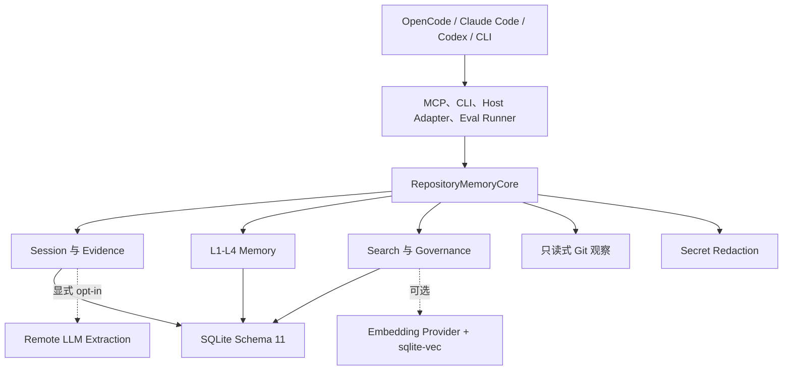
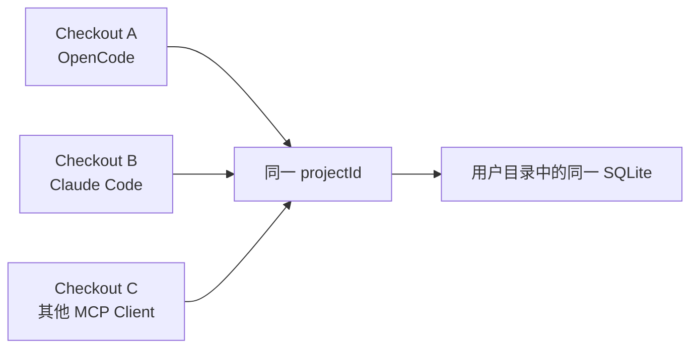
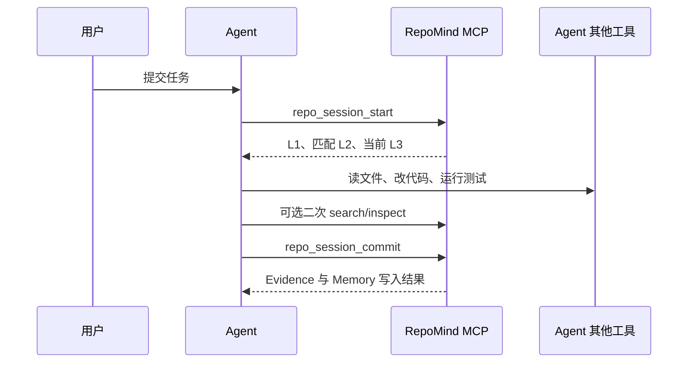
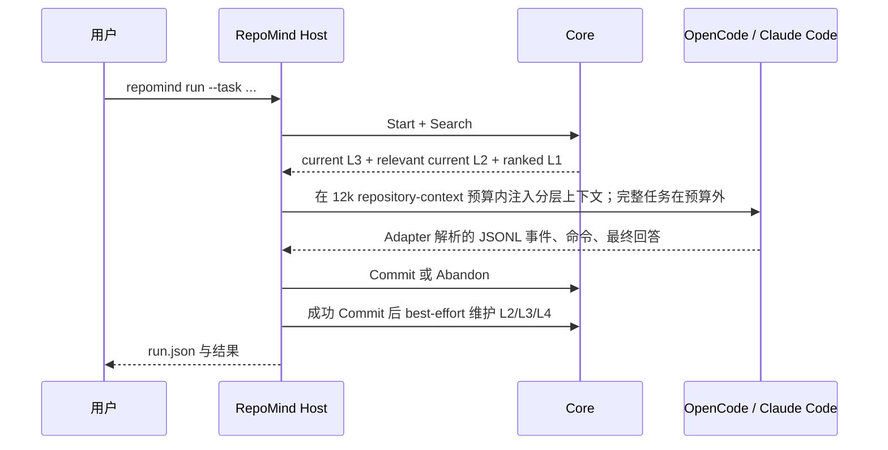
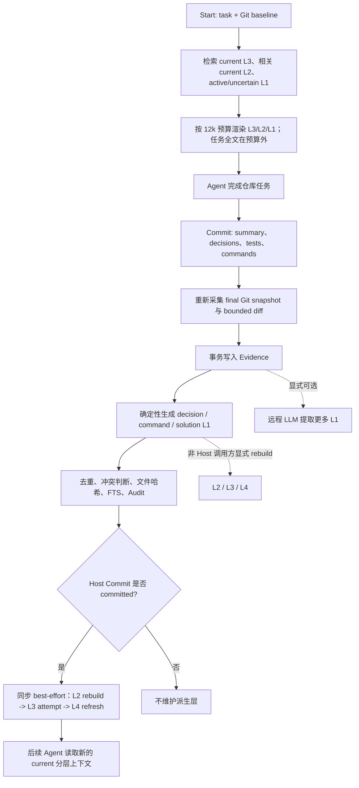

# 01 项目总览与系统架构

## 1. 项目要解决的真实问题

Coding Agent 在单次任务中通常能读代码、运行命令、修改文件并执行测试，但一旦会话结束，许多高价值信息就消失了，例如：

- 某个架构选择为什么这样做；
- 某条看似合理的修复为什么曾经失败；
- 真实可用的测试命令是什么；
- 文件迁移后新入口在哪里；
- 某个隐含约束只存在于历史任务中，而当前代码无法直接恢复；
- Agent A 已经验证过的结论，Agent B 又从头探索一次。

常见方案各有缺陷：

| 方案 | 问题 |
| --- | --- |
| 每次重新扫描整个仓库 | 重复读取多、耗时高；代码中不一定保留历史原因和失败经验 |
| 注入完整对话或任务历史 | 上下文大、噪声多、容易携带过期结论，跨 Agent 格式也不统一 |
| 只做向量库 | 缺少证据、状态、冲突、删除和生命周期，无法判断记忆为何可信 |
| 让模型自由写“长期记忆” | 容易把未经验证的推断固化，难以审计和纠错 |

RepoMind 的回答是：将仓库历史压缩为有来源的原子事实，用显式生命周期采集证据，用状态机治理事实，再按任务检索少量上下文。

## 2. 设计目标与非目标

### 2.1 设计目标

1. **跨会话**：同一个 Agent 的新会话能复用旧会话结论；
2. **跨 Agent**：OpenCode、Claude Code 或其他 MCP 客户端共享统一数据模型；
3. **Evidence-backed**：自动生成的 Memory 能追溯到任务、Git、测试或命令 Evidence；
4. **低上下文成本**：默认返回 L1 结论，不把大段 diff 和原始历史塞进 Prompt；
5. **可治理**：陈旧、冲突、纠错、失效和物理删除都有明确语义；
6. **Local-first**：默认使用本地 SQLite 和 FTS5，远程能力显式开启；
7. **可评测**：用真实 Agent、隐藏检查、三臂配对实验衡量正确率和效率。

### 2.2 非目标

当前版本不提供：

- 自动监听任意 Agent 的宿主工具；
- 云同步或多用户服务；
- 跨机器实时共享；
- 逻辑 Merge Import；
- 自动安装或执行 L4 Skill；
- Live SQLite 数据库加密；
- 对所有秘密格式都可靠的 DLP；
- 对冲突内容的通用语义理解。

这些边界不是文档遗漏，而是 [`release-readiness-v1.0.md`](../docs/release-readiness-v1.0.md) 中冻结的 v1.0 产品范围。

## 3. 总体架构



依赖方向是向下的：MCP、CLI、OpenCode Adapter 和评测工具都调用同一个 [`RepositoryMemoryCore`](../src/core.ts)。Core 不依赖 MCP SDK，因此业务规则不会分别散落到每个 Agent 集成中。

这项设计的价值是：

- CLI 与 MCP 的 Session/Memory 语义一致；
- 测试可以直接驱动 Core，不需要启动 Agent；
- 更换 Agent 只需要适配生命周期和协议，不需要迁移记忆模型；
- 评测运行的就是生产检索路径，而不是单独制作的基准版本。

## 4. 仓库身份与跨 Agent 原理

执行 `repomind init` 后，仓库中只写入：

```text
.repomind/project.json
```

其中包含稳定的 Project ID 和名称。实际数据库默认位于：

```text
~/.repomind/repositories/<projectId>/repomind.db
```

也可以通过 `REPOMIND_DATA_DIR` 修改根目录。



跨 Agent 并不是把 Claude 对话转换成 OpenCode 对话，也不是依赖某个模型专属 Memory API。不同 Agent 只要：

1. 能定位同一个仓库 marker；
2. 使用同一个用户数据目录；
3. 通过 CLI、MCP 或宿主适配器调用同一个 Core；

就能读写同一套 Session、Evidence 和 Memory。

需要准确区分：

- **跨 Agent 已分层验证**：历史 v0.15 验收证明 OpenCode/Claude 共享 Project DB 与 L4 生命周期；2026-08-11 的 OpenCode -> Claude repeat 5 又证明 Claude 能在 `L1=0` 时消费由 OpenCode Session 派生的 L2/L3。当前证据仍只有一个任务方向，不等于双向、多任务或所有 Agent 都已验证；
- **支持接入但仓库内未做同等验收**：Codex 有 MCP 配置和 Agent 指令示例；
- **未实现**：跨机器自动同步。跨机器需要 export/import 或 backup/restore。

## 5. 为什么必须使用显式 Session

MCP Server 只能看到对自身工具的调用，无法看到宿主 Agent 通过其他工具做了什么。它不知道 Agent 是否：

- 修改了文件；
- 执行了某条 Shell 命令；
- 测试是否通过；
- 已经完成还是中途失败。

因此 RepoMind 使用：

```text
repo_session_start
    -> Agent 使用自己的文件/Shell/测试工具
repo_session_commit
```

Start 记录 Git baseline 并检索历史；Commit 再读取 final Git 状态和 diff，同时接收宿主上报的 summary、decisions、tests、commands。

这种设计比“被动假装能观察一切”更诚实，也明确了证据来源：Git 内容由 RepoMind 自己采集，而测试 exit code 和 Agent summary 是宿主提交的声明。

## 6. 两种生命周期模式

### 6.1 Agent-managed



优点：Agent 可以主动二次检索、inspect 和治理。
缺点：Start/Commit 占用模型轮次，Agent 可能忘记调用，Commit Payload 质量依赖提示词遵循。

### 6.2 Host-managed



Host-managed 把生命周期移到模型循环外，避免额外模型调用，并保证正常退出、失败、超时等路径都能闭合 Session。正式 v0.8 实验中，这一改变将 v0.7 相对 full-history 的性能劣势扭转为平均更快。

当前边界：

- Host Registry 已支持 OpenCode 与 Claude Code；Codex 尚无 Host Adapter；
- 各 Adapter 只解析各自已知的 JSONL 与命令事件，不会观察 `repomind run/eval` 之外任意启动的 Agent 工具；
- Agent 内的 RepoMind MCP 被禁用，若检测到直接调用会判定生命周期违规；
- Host 只注入 current L3、current L2 和 Start 已排序的 L1。默认 `12,000` 字符预算只约束三个 section body，采用 L1:L2:L3=`5:3:2` 的加权分配；任务全文、生命周期说明、标题和信任边界说明位于预算外，不截断；
- 该自动化只属于 Host-managed helper 和 `repomind run`。Core/CLI/MCP/Agent-managed Commit 不会被悄悄改变语义，仍由调用方显式维护派生层。

## 7. 一次任务的端到端数据流



这里有四个关键边界：

1. Remote Extraction 不在 Commit 中自动发生；
2. 只有 Host-managed 成功 Commit 自动维护 L2/L3/L4；direct Core、CLI、MCP 和 Agent-managed Commit 仍需显式 rebuild；
3. 派生层维护是 best-effort：单层失败会记录 error 并继续其他层，不回滚已经成功的 Session Commit；没有 L3 来源时为 skipped；
4. RepoMind 不自动执行测试来核验宿主上报的 exit code，L4 也不自动 approve/export/install/execute。

这组边界把日常 Host 路径的维护延迟缩短，同时保留其他入口的显式语义和 L4 的人工审核边界。

## 8. 组件职责

| 组件 | 职责 | 不负责什么 |
| --- | --- | --- |
| Core | 生命周期、数据规则、检索、治理、分层入口 | Agent UI、MCP transport 细节 |
| SQLite | Source of Truth、关系与审计、事务 | 语义推理 |
| FTS5 | 默认本地检索 | 深层语义召回 |
| sqlite-vec | 可选向量距离计算 | Source of Truth |
| Git Inspector | baseline/final/diff 的受限采集 | 执行构建、测试或修改 Git 状态 |
| Redaction | 已知 secret 模式和敏感路径保护 | 完整 DLP 保证 |
| MCP | 参数校验、错误映射、Core 暴露 | 保存独立业务规则 |
| Agent Host + Adapter | 通用生命周期、Prompt 注入、OpenCode/Claude 事件解析、运行产物 | 被动观察外部 Agent 或支持任意未知事件协议 |
| Eval | 三臂调度、隔离、隐藏检查、指标聚合、完整性门槛 | 替代真实外部验证 |

## 9. 核心工程决策

### 9.1 SQLite 作为 Source of Truth

记忆、Evidence、关系、状态、来源和审计天然适合关系模型。事务能保证 Commit 或远程提取不会留下半批数据；FTS 和向量都可作为派生索引重建。

### 9.2 FTS5 优先于向量

代码仓库查询大量包含标识符、文件路径和命令，词法匹配很重要。FTS5 零远程依赖、可复现、易降级；向量只在显式配置后增强同义表达召回。

### 9.3 Evidence 与 Memory 分离

Recall 只返回短结论；需要验证时再 inspect Evidence。这样同时保留上下文效率和可追溯性。

### 9.4 信号驱动状态，而不是时间衰减

“记忆变老”不等于“记忆错误”。RepoMind 使用文件哈希变化、冲突和人工治理改变状态，避免按日期机械降权。

### 9.5 派生层可重建，Host 成功路径自动维护

L2-L4 都可以从底层事实重建。Host-managed 成功 Commit 会同步执行 best-effort 维护，以便下一次任务尽快看到 current L2/L3 和新的 pending L4 Candidate；非 Host Commit 保留手工 rebuild 命令。即使维护失败，L0/L1 和 committed Session 仍是已经完成的 Source of Truth，不会因派生层故障被回滚。

## 10. 适用场景

RepoMind 最适合：

- 长期维护、任务跨多次 Session 的仓库；
- 多个 Coding Agent 轮流工作的本地开发环境；
- 架构约定、失败经验、迁移规则无法只从当前代码恢复的项目；
- 希望用隐藏测试和真实 Agent 量化 Memory uplift 的团队；
- 对“为什么相信这条上下文”有审计要求的 Agent 工程。

收益可能较小的场景：一次性脚本、任务完全由当前代码决定、仓库极小、历史上下文本来就很短且无噪声，或用户从不提交高质量 Session Evidence。

## 11. 如何准确介绍这个项目

推荐的项目介绍是：

> RepoMind 是一个面向 Coding Agent 的本地仓库记忆系统。它用显式 Session 捕获任务、Git 和宿主上报的测试证据，把原始 Evidence 与可召回的 Memory 分离，并通过 FTS5/可选向量检索、文件哈希陈旧检测、冲突状态机和 L0-L4 分层，让不同 Agent 在后续任务中复用少量、可追溯、可治理的仓库知识。项目还内置 Host-managed OpenCode 运行器和三臂真实 Agent 评测，用隐藏检查同时衡量正确率、Token、耗时与文件读取。

不要把它介绍成“自动监控所有 Agent”“一个向量数据库”或“自动执行 Skill 的多 Agent 平台”，这些都超过了当前实现。
