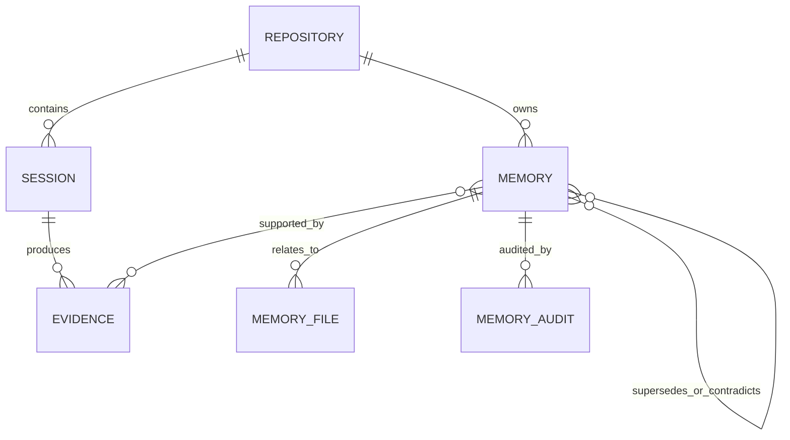
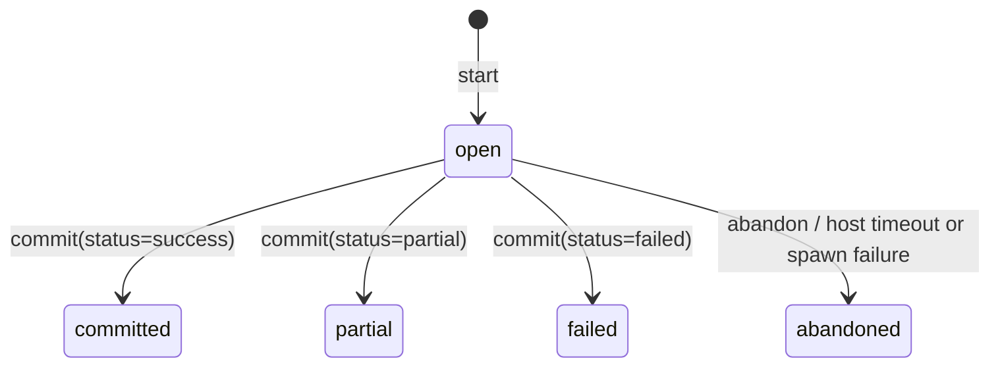
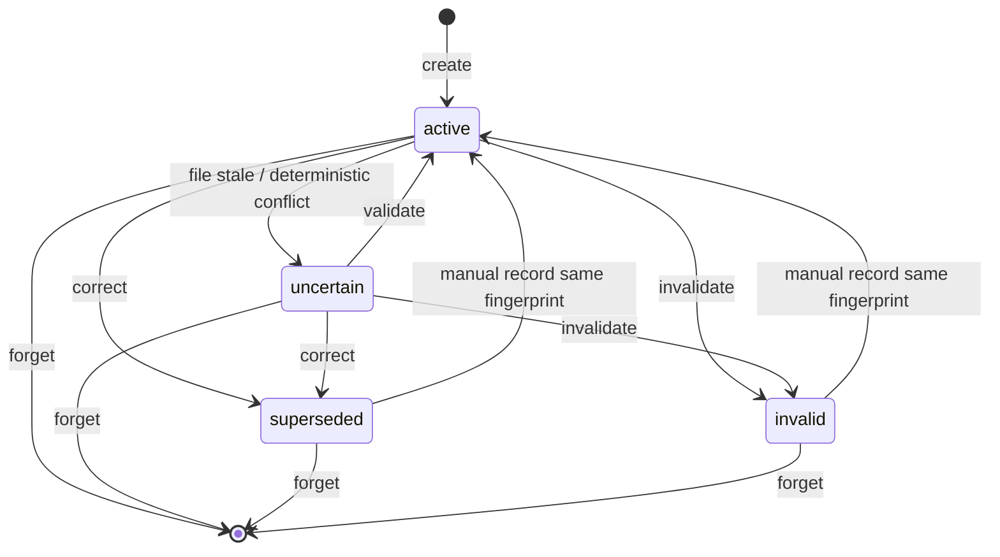

# 02 核心数据模型与记忆原理

## 1. 核心抽象：Session、Evidence、Memory

RepoMind 没有把“聊天记录”直接当长期记忆，而是拆成三个不同职责的对象：

| 对象 | 回答的问题 | 特性 |
| --- | --- | --- |
| Session | 这次仓库任务从何时开始、如何结束？ | 有明确生命周期和 Git baseline/final |
| Evidence | 实际记录或上报了什么？ | 内容较原始、可审计、通常不直接召回 |
| Memory | 后续任务值得复用的结论是什么？ | 原子化、短、可检索、带状态和来源 |

关系如下：



这种分离解决了两个相反需求：

- Agent Recall 需要短、直接、低 Token 的上下文；
- 人工审查需要知道结论的来源、文件关系、状态变化和历史理由。

如果把 Evidence 全部塞进 Recall，Git diff 会淹没任务；如果只保存结论而丢掉 Evidence，又无法回答“为什么相信它”。

## 2. L0-L4 分层模型

### 2.1 L0：Evidence

当前类型定义支持以下 Evidence Kind：

| Kind | 含义 | 主要信任来源 |
| --- | --- | --- |
| `user_requirement` | Start 时提交的任务文本 | 用户或宿主声明 |
| `agent_summary` | Commit 时提交的最终总结 | Agent 或宿主声明 |
| `git_snapshot` | branch、HEAD、dirty、porcelain status | RepoMind 调用 Git 采集 |
| `git_diff` | baseline 到 final、working tree、staged 的有界 diff | RepoMind 调用 Git 采集 |
| `file_snapshot` | 文件级快照类型 | 数据模型支持，非默认 Commit 主路径 |
| `test_result` | 命令、exit code、摘要 | 宿主上报，不由 Core 重跑 |
| `command_result` | 一般命令结果 | 宿主上报 |
| `commit` | 提交型 Evidence | 数据模型支持 |
| `manual` | 人工记录 Memory 时的来源 | 人工声明 |
| `validation` | 人工验证理由与当前文件状态 | 人工治理 |
| `correction` | 纠错理由 | 人工治理 |
| `invalidation` | 失效理由 | 人工治理 |

Evidence 落库时经过模式脱敏，并保存脱敏后正文的 SHA-256 `content_hash`。需要注意：这个 hash 当前主要用于身份、去重和归档校验，普通读取不会自动重算，因此不能把数据库描述成“密码学防篡改账本”。

Evidence 在正常 API 中接近 append-only，但不是绝对不可删除：`forget --scope memory-and-evidence` 可以删除没有被其他 Memory 引用的 Evidence，数据库也没有禁止管理员直接 UPDATE 的 trigger。

### 2.2 L1：Atomic Memory

L1 是检索和治理的基本单位，一条只表达一个可复用事实。

| 类型 | 典型内容 | 是否参加声明性冲突检测 |
| --- | --- | --- |
| `architecture` | 模块边界、职责 | 是 |
| `convention` | 编码或流程约定 | 是 |
| `decision` | 技术选择及原因 | 是 |
| `dependency` | 版本和依赖约束 | 是 |
| `location` | 关键实现位置 | 是 |
| `requirement` | 长期需求 | 是 |
| `risk` | 风险和危险区域 | 是 |
| `command` | 已上报成功的命令 | 否，属于事件历史 |
| `failure` | 已确认失败经验 | 否，属于事件历史 |
| `solution` | 已完成解决方案 | 否，属于事件历史 |

一条 L1 还包括：

- `confidence`：0 到 1；
- `status`：active、uncertain、superseded、invalid；
- `scopeType`：repository、module、path；
- `scopeValue`：模块或路径 scope 的值；
- tags；
- fingerprint；
- related files 及其 hash、size、mtime；
- Evidence 多对多关联；
- Audit 和 Memory Relation。

好的 L1 应脱离原对话仍然有意义。例如：

```text
差：修好了 Windows 问题。
好：Windows 下 native module 因 Node ABI 不匹配加载失败；在目标 Node 版本重新安装依赖后恢复，验证命令为 npm test -- loader。
```

### 2.3 L2：Module Narrative

L2 将一个模块相关的 active、Evidence-backed L1 组织为固定结构的模块说明，包括：

- 职责与边界；
- 技术决策；
- 失败与验证；
- 风险。

它是确定性模板拼装，不调用 LLM。默认最多 4,000 字符；可配置 500-20,000。它减少 Agent 为理解模块反复拼接多个原子事实的成本，但旧正文会覆盖更新，没有独立历史版本表。

### 2.4 L3：Repository Profile

L3 是仓库级稳定摘要，来源是：

- 高置信度、active、Evidence-backed、repository scope 的稳定类型 L1；
- 当前 L2 的模块边界及其底层 L1。

默认置信度阈值 0.8，默认预算 6,000 字符，可配置 1,000-30,000。L3 保留每个版本的正文和来源 ID；来源变化后旧版本仍可 inspect，但不再作为 current 注入。

### 2.5 L4：Skill Candidate

L4 从至少三个成功 committed Session 中寻找重复工作流。当前算法依据成功 `command_result` 和 `test_result` 的规范化集合构造签名，生成：

- trigger；
- inputs；
- steps；
- verification；
- risks；
- Session/Evidence 来源。

候选必须人工 approve 才能导出新的 `SKILL.md`，RepoMind 不安装、不注册、不执行它。

L4 的“学习”应理解为确定性模式归组，不是从任意 Agent 轨迹中训练策略。命令集合会排序，因此丢失执行顺序；任务语义不参与签名，同命令集的不同任务可能被归在一起。这正是审批环节不可省略的原因。

## 3. Session 状态机



没有 reopen。结束状态用于表达这次生命周期，而不是直接判断所有 Memory 是否可信。

### 3.1 Start 的实际行为

[`startSession`](../src/core.ts) 依次完成：

1. 校验 task 非空；
2. 调用 Git Inspector 获取 baseline；
3. 对 task 脱敏；
4. 在一个 SQLite 事务中创建 open Session；
5. 写入 `user_requirement` 与 baseline `git_snapshot` Evidence；
6. 事务后检索 L1、匹配最多 2 条 L2、读取 current L3；
7. 若检索失败，尝试把已创建 Session 标为 abandoned。

`startSessionHybrid` 先完成普通 Start，再用 Hybrid Search 替换 L1 结果，并返回实际策略和 fallback reason。

### 3.2 Commit 的实际行为

Commit 前：

1. 检查幂等回执；
2. 确认 Session 存在且仍是 open；
3. 重新读取 final Git snapshot；
4. 捕获 bounded diff；
5. 从 final porcelain status 提取 related file 候选。

Commit 事务内：

1. 写 `agent_summary`；
2. 写 final `git_snapshot`；
3. 有内容或敏感排除记录时写 `git_diff`；
4. 写宿主提交的 test/command Evidence；
5. 确定性生成 L1；
6. 更新 Session 结束状态；
7. 写 `commit_receipts`。

整个数据库变更原子提交，但 Git 的多次读取发生在事务外，也不是一个原子 Git 快照。

`commitSession` 本身到这里结束，不隐式重建 L2-L4。`repomind run` 的 Host-managed helper 只在结果为 `committed` 后，另起一个同步的 best-effort 阶段调用 `maintainDerivedLayers()`：依次重建 L2、尝试 L3、刷新 L4 Candidate。这个阶段不属于 Commit 事务，失败会单独记录，不回滚 Session；partial、failed、abandoned 不进入该阶段。CLI/MCP/直接 Core Commit 的语义保持不变，仍需显式 rebuild。

## 4. 确定性 L1 提取规则

Commit 不依赖 LLM 就能生成三类 L1：

| 输入 | 条件 | 输出 | 置信度 | Evidence 绑定 |
| --- | --- | --- | ---: | --- |
| `decisions[]` | 每条非空决策 | `decision` | 0.85 | Agent summary |
| `tests[]` | `exitCode === 0` | `command` | 0.95 | 对应 test Evidence |
| `summary` | Session status 是 success 且 summary 非空 | `solution` | 0.80 | Commit 阶段创建的全部 Evidence |

这里必须准确解释“verified command”：RepoMind 验证的是输入结构和 `exitCode === 0` 条件，Core 本身没有重新执行测试。真实性依赖 Host Adapter 对事件的采集质量，或 Agent-managed 客户端是否诚实提交。

Decision 只直接绑定 summary Evidence，并不自动直接绑定 Git diff。Solution 绑定的 Evidence 更广，但“有 diff”仍不等于 summary 中每个语义结论都由 diff 证明。

## 5. Memory 去重、指纹与复活

Memory fingerprint 将规范化后的类型、内容和 scope 等身份字段映射为稳定 hash，并在 `(repository_id, fingerprint)` 上唯一约束。

效果：

- 重复记录同一事实不会产生多个 L1；
- 自动提取遇到已有 fingerprint 时跳过或增加来源；
- retired Memory 持续占有 fingerprint，防止自动提取悄悄复活已纠错或失效事实；
- 手工 `record` 同一 fingerprint 可以显式重新激活 superseded/invalid Memory。

去重不是语义聚类。两段不同措辞通常有不同 fingerprint；远程提取另有一层受限的近似等价判断，但会保护数字差异和否定关系，避免把相反结论合并。

## 6. Memory 状态机



不同治理操作的语义：

| 操作 | 旧正文是否保留 | 是否产生新 Memory | 是否写 Audit/Evidence |
| --- | --- | --- | --- |
| validate | 保留 | 否 | 是，更新文件 hash |
| correct | 保留为 superseded | 是，replacement | 是，建立 supersedes |
| invalidate | 保留为 invalid | 否 | 是 |
| forget | 物理删除 | 否 | 留下不含正文的 forget tombstone |

Search 默认返回 active 和 uncertain；uncertain 会携带 warning。它不是被完全隔离。superseded 和 invalid 默认不会进入 Recall。

## 7. Evidence 关系与可信强度

“Evidence-backed”不等于“所有 Evidence 同样客观”。可以按来源划分：

| 强度 | 示例 | 解释 |
| --- | --- | --- |
| RepoMind 独立观察 | Git branch/HEAD/status/diff | 由受限 Git 调用获取，但不是单次原子快照 |
| 宿主结构化上报 | test/command + exit code | Host-managed 可从事件中提取；Core 不重跑 |
| Agent 声明 | summary、decisions | 有价值但可能夸大或遗漏 |
| 人工治理 | manual、validation、correction | 带理由，质量取决于审查者 |
| Remote LLM 候选 | 引用已有 Evidence ID | 通过格式和引用校验，但不证明语义蕴含 |

面试时更准确的表述是：“RepoMind 让每条自动 Memory 至少有可检查的来源，并区分 Git 观察与 Agent 声明；它提高可审计性，但不把模型输出转换成数学证明。”

## 8. 事务、WAL 与幂等

### 8.1 SQLite 事务

[`database.ts`](../src/storage/database.ts) 使用 Node `DatabaseSync`：

- `foreign_keys=ON`；
- WAL；
- 5 秒 busy timeout；
- 外层事务 `BEGIN IMMEDIATE`；
- 嵌套事务使用 SAVEPOINT；
- 异常自动 rollback；
- Migration 按版本逐个事务执行。

Commit、治理和远程提取中的多表更新由事务保护，避免 Evidence 已写入但 Memory/Audit 未完成的半状态。

### 8.2 Commit 幂等

主键是：

```text
(session_id, idempotency_key)
```

完整输入经过稳定键序 JSON 后 hash：

- 同 key + 同 request hash：返回原结果，不重复写；
- 同 key + 不同 request hash：拒绝，防止误用；
- receipt 与 Commit 数据在同一事务写入。

这可描述为“支持正常顺序下的安全重试”，不应夸大为多进程并发 exactly-once。Receipt 和 Session status 的第一次检查、Git 采集都在写事务前；两个进程使用不同 key 同时 Commit 同一 Session 的 compare-and-set 边界还不完整。

## 9. Schema 11 的表结构

| 领域 | 表 |
| --- | --- |
| 仓库身份 | `repositories`、`repository_checkouts` |
| 生命周期 | `sessions`、`host_runs` |
| L0/L1 | `evidence`、`memories`、`memory_evidence`、`memory_files` |
| 治理 | `memory_audit_log`、`memory_relations`、`forget_log` |
| 幂等 | `commit_receipts` |
| 派生索引 | `memory_fts`、`memory_embeddings` |
| L2 | `module_narratives`、`module_narrative_sources`、`module_narrative_fts` |
| L3 | `repository_profiles`、两类 source 表、`repository_profile_versions` |
| L4 | `skill_candidates`、Session/Evidence source 表、Audit 表 |

FTS 和 Embedding 是派生数据。FTS 可以通过 `reindex` 重建；向量通过 `vector-reindex` 重建。逻辑导出不需要携带这些派生索引。

## 10. 远程 LLM 提取

远程提取是 Commit 后显式调用的第二阶段：

```text
completed Session
  -> 读取已脱敏 Evidence
  -> 每条最多 12,000 字符，总批次最多 60,000
  -> 远程 OpenAI-compatible structured output
  -> Zod + Evidence ID + scope + path + size 全批校验
  -> 一个 SQLite 事务写入
```

关键约束：

- 默认关闭；
- 可以处理 committed、partial、failed Session；
- 最多 50 个候选；
- title 最多 160 字符，content 最多 8,000；
- confidence 最大 0.9；
- 每个候选必须引用本次请求提供的 Evidence ID；
- Evidence ID 不能伪造或重复；
- module/path scope 必须是仓库相对路径；
- related files 不能逃逸仓库；
- 任一候选非法，整批零写入；
- provider timeout、拒绝、无效 JSON 或取消也零写入。

这是一种“模型在事务外生成，确定性代码在事务前验证，事务内统一持久化”的边界设计。

仍然不能声称模型结论必然被 Evidence 语义支持。Schema 能证明引用存在、格式合法、路径安全，不能做自然语言逻辑证明。

## 11. Bootstrap 冷启动

新仓库尚无 Session 时，可以生成待审候选：

- 根 README；
- 根 CONTRIBUTING；
- `docs/adr` 直接子目录最多 50 个 Markdown；
- 最近 20 条 Git commit subject。

它不会扫描整个代码仓库。单个 Markdown 超过 128 KiB 会跳过；frontmatter 和 fenced code 会移除；正文有长度限制。

默认置信度：README 0.55、CONTRIBUTING 0.7、ADR 0.8、Git history 0.4。生成 bundle 不写 Memory，只有 `bootstrap-apply --yes` 才按选中的 Candidate 调用 `record`。

为什么要 Review：README 可能是营销文本，历史 commit subject 可能过时，ADR 也可能已被替代。冷启动只能提供候选，不应冒充经过 Session 验证的事实。

## 12. 多 Checkout 的数据语义

相同 Project ID 的多个 checkout 在同一数据目录下共享项目数据库；checkout 自己有独立 ID。这样可以跨 Agent 和 worktree 复用知识，但状态是 project-global，不是 branch-local。

一个 checkout 搜索时会按自己的当前文件内容刷新 stale 状态，并可能把共享 Memory 标为 uncertain，其他 checkout 随后也会看到这个状态。这对多分支开发是重要限制：当前模型更接近“项目全局事实”，而不是“按 branch/version 隔离的事实”。

## 13. 这一数据模型的主要亮点

1. **结论和来源分离**：Recall 小，Inspect 深；
2. **事务闭环**：Evidence、L1、Session 状态和 receipt 同时落库；
3. **派生索引可重建**：向量失效不影响 Source of Truth；
4. **显式退休而非覆盖**：纠错保留旧事实与关系；
5. **删除可审计**：正文物理删除，同时留下无内容 tombstone；
6. **远程输出全批验证**：避免半批污染；
7. **统一 Core**：CLI、MCP、Host 和 Eval 共享业务语义；
8. **信任来源可解释**：能够区分 Git 观察、宿主上报、Agent 声明和人工决策。

## 14. 应重点掌握

- 为什么 Evidence/Memory 不能合并成一张表；
- Start 和 Commit 分别采集什么，哪些发生在事务外；
- 三类确定性 L1 的生成条件和置信度；
- 幂等回执能保证什么、不能保证什么；
- active/uncertain/superseded/invalid 的语义；
- L0-L4 的抽象成本与来源链；
- 远程 LLM 为什么先全批校验再事务写入；
- 同一 Project ID 共享数据库带来的跨 Agent 优势和多分支限制。
