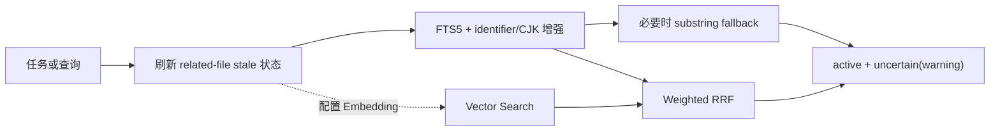
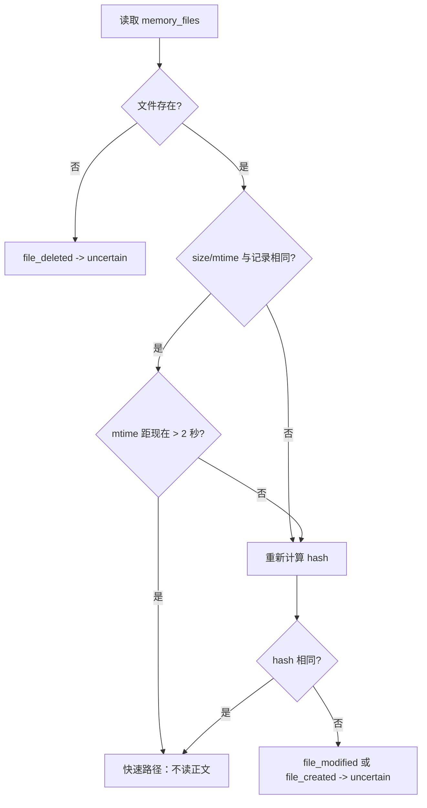
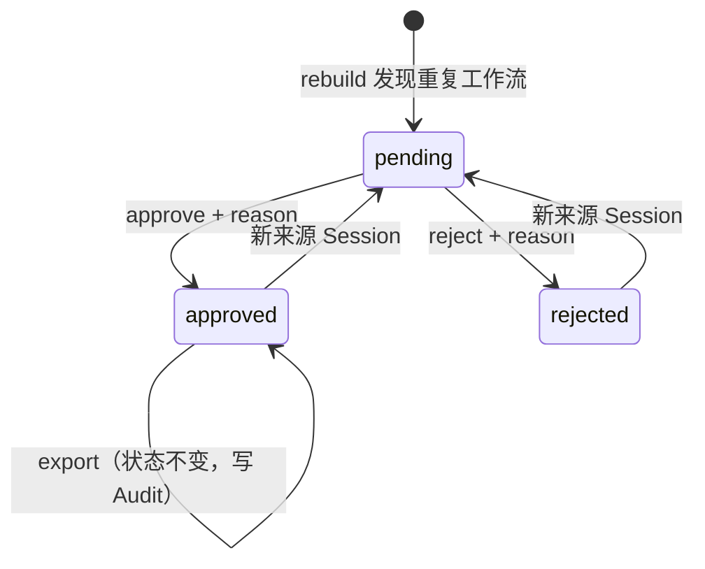

# 03 分层记忆、检索与治理

## 1. 检索要解决的不是“最相似文本”一个问题

仓库记忆检索同时面对四种需求：

1. 精确找到标识符、命令、文件路径；
2. 能处理中文和其他缺乏空格分词的文本；
3. 可选支持同义表达的语义召回；
4. 不能把已失效或已纠正的结论静默注入 Agent。

因此 RepoMind 的检索链路是：



默认路径完全本地，只使用 FTS5。向量是可选增强，不是系统可用性的前提。

## 2. FTS5 词法检索

### 2.1 索引内容

`memory_fts` 保存：

- title；
- content；
- 额外 `search_tokens`。

[`searchTokens`](../src/search/lexical.ts) 将以下内容拼接并转为小写：

1. 原始 title、content、tags、related files；
2. 标识符拆分版本；
3. 连续表意文字的重叠 bigram。

例如：

```text
repoSessionStart -> repo Session Start
memory_files     -> memory files
src/git/path.ts  -> src git path ts
中文检索         -> 中文 文检 检索
```

代码仓库里的查询往往不是自然语言，而是函数名、路径、配置键或错误码。标识符增强能让用户搜索 `session` 时召回 `repoSessionStart`，也能用 `memory` 找到 `memory_files`。

### 2.2 查询表达式

查询同样进行清洗和 CJK bigram 扩展，然后生成 quoted term 的 OR 表达式。结果按 FTS5 `bm25` 排序。

OR 的取舍是提高召回率，代价是宽泛查询可能返回只命中部分词的记录。后续可通过 limit、type/status filter 和 Agent inspect 控制。

### 2.3 Substring fallback

当 FTS 结果不足，并且查询包含 CJK 或只有一个词法 term 时，RepoMind 会补充 SQL `LIKE` 扫描 title/content。

为什么只在这些情况触发：

- CJK 的 tokenizer 行为需要额外兜底；
- 单 token 的部分字符串可能无法由 FTS token 命中；
- 多个非 CJK term 的整句 substring 若存在，理论上至少会命中一个 FTS term，无需总做全表扫描。

Fallback 提高召回，但大表上比 FTS 更贵，因此是条件触发而非默认全表扫描。

### 2.4 状态过滤

默认状态：

```text
active + uncertain
```

`uncertain` 结果带 warning，允许 Agent 在知情情况下使用或进一步 inspect。`superseded` 和 `invalid` 默认不召回。

这是一个重要设计选择：文件变化只说明结论需要复核，不必然说明完全错误。如果一律丢弃 uncertain，可能同时损失仍有价值的历史信息。

## 3. 向量检索

### 3.1 Provider

支持：

- `deterministic`：离线 feature-hash，服务于可复现测试，不是真正训练得到的语义模型；
- `openai-compatible`：远程 `/embeddings` API。

默认未配置 Provider。维度默认 256，可通过环境变量设置。

### 3.2 派生缓存

`memory_embeddings` 记录：

- memory ID；
- repository ID；
- model；
- dimensions；
- title + content hash；
- embedding blob；
- 更新时间。

查询前先同步缺失或过期向量：

1. 找出 model、dimensions 或 content hash 不匹配的 Memory；
2. 每批最多 64 条调用 Provider；
3. 验证数量、维度和有限数值；
4. 所有批次成功后，在一个事务中 upsert。

因此 Provider 失败不会留下本轮半批缓存。

当前实现会同步项目中的所有 Memory，包括 retired 状态；真正查询时才按 active/uncertain 过滤。这保证缓存一致但可能浪费 Embedding 成本，是可优化点。

### 3.3 远程数据边界

远程 Embedding 会收到：

- 已存 Memory 的 title/content；
- 当前查询文本。

它不会收到完整 Evidence 或 Git diff。需要注意一个实现细节：Start 首次本地存储 task 时会脱敏，但 `startSessionHybrid` 随后使用原始 `input.task` 进行 Hybrid Query；开启远程 Embedding 后，原始查询可能发送到 Provider。这是当前需要硬化的隐私边界。

## 4. Hybrid Search 与 Weighted RRF

词法和向量各取最多 20 个候选，然后使用 Weighted Reciprocal Rank Fusion：

```text
score(d) = 0.65 / (60 + rank_lexical(d))
         + 0.35 / (60 + rank_vector(d))
```

其中 rank 从 1 开始；记录未进入某一列表时，该部分为 0。

### 4.1 为什么使用 RRF

FTS 的 BM25 分数和向量 cosine distance 不在同一尺度，直接线性相加需要复杂归一化。RRF 只依赖排名，能稳定融合不同检索器。

词法权重 0.65 高于向量 0.35，符合代码仓库特性：标识符、路径和命令的精确匹配通常比宽泛语义更重要。

常数 60 降低排名头部的小幅交换对总分的剧烈影响，让两路共同出现的文档更稳定地获益。

### 4.2 降级策略

以下任一情况都会返回 FTS 结果，并给出 `fallbackReason`：

- 未配置 Embedding；
- sqlite-vec 无法加载；
- Provider 请求失败或超时；
- 返回数量或维度错误；
- 出现 NaN/Infinity；
- Vector sync/search 失败。

这体现了“增强能力可失败，基础能力仍可用”的设计。Memory 写入也不依赖远程向量服务。

## 5. 文件陈旧检测

### 5.1 创建 Memory 时保存什么

每个 related file 保存：

- 仓库相对路径；
- SHA-256；
- size；
- mtime milliseconds。

### 5.2 惰性刷新算法

Stale 检查在 search、inspect、review 和 L2/L3 操作前触发，不是后台 watcher。



两秒窗口用于规避 racy-mtime：某些文件系统时间粒度下，快速连续修改可能保持相同 size 和 mtime。窗口内即使 metadata 相同也重算 hash。

同一次刷新会缓存 stat/hash，同一文件关联多个 Memory 时只读一次，降低 10,000 条 L1 场景的重复 I/O。

### 5.3 状态语义

文件变化后 Memory 转为 uncertain，并记录：

- `file_created`；
- `file_modified`；
- `file_deleted`；
- expected/current hash。

即使文件随后恢复为原 hash，也不会自动回 active，需要人工 validate。原因是“内容恢复”不一定代表业务语义重新成立，人工确认更安全。

### 5.4 覆盖边界

- 只检查显式 related files；纯语义变化无法发现；
- Commit 自动 related files 来自 final porcelain status；若 Agent 已提交且工作树最终 clean，自动 L1 可能没有 related files；
- baseline 已 dirty 时，最终 dirty 文件可能包含本任务未修改的文件；
- untracked 文件内容不进入 Git diff；
- 项目共享状态不是 branch-local，一个 checkout 可使其他 checkout 看到 uncertain。

## 6. 冲突检测

### 6.1 精确条件

只有声明性类型参与：

```text
architecture / convention / decision / dependency /
location / requirement / risk
```

新 Memory 与现有 live Memory 同时满足以下条件时判定冲突：

1. 同 repository；
2. 同 type；
3. 同 scope type/value；
4. title 忽略大小写后完全相同；
5. content fingerprint 不同。

双方都会变为 uncertain，写入双向可查的 `contradicts` relation 和 Audit。

### 6.2 为什么 episodic 类型不参加

`command`、`failure`、`solution` 描述发生过的事件。同一命令昨天失败、今天成功并不矛盾，而是历史演变；强行冲突会丢失排障经验。

### 6.3 算法边界

这不是语义矛盾检测：

- 不同 title 的相反事实可能漏检；
- 同 title 的兼容补充也可能误报；
- 数值和否定的含义不由通用逻辑模型判断。

因此更准确的名称是“确定性冲突启发式”。

### 6.4 冲突消解

- validate 一方：该方回 active，另一方仍 uncertain；关系保留；
- correct：创建 replacement，旧 Memory superseded；
- invalidate/forget 某方：当最后一个 live conflict 消失时，剩余一方可自动恢复 active；
- Review Queue 将 conflict 与 stale 分类展示。

## 7. 人工治理工作流

### 7.1 单条治理

```powershell
repomind inspect <memory-id> --repo D:\path\to\repo --json

repomind memory-validate <memory-id> `
  --reason "已核对当前实现，结论仍成立" `
  --repo D:\path\to\repo --json

repomind memory-correct <memory-id> `
  --reason "模块已经迁移" `
  --title "新的模块入口" `
  --content "入口位于 src/new/location.ts" `
  --repo D:\path\to\repo --json

repomind memory-invalidate <memory-id> `
  --reason "该约定已废弃" `
  --repo D:\path\to\repo --json
```

### 7.2 批量 Review

```powershell
repomind review --kind stale --limit 50 --repo D:\path\to\repo --json
repomind review-history --limit 100 --repo D:\path\to\repo --json
```

`review-apply` 一次最多处理 100 条 validate/invalidate，并在统一事务中应用。提交前会确认所有 ID 唯一、理由非空且当前仍是 uncertain，避免半批成功。

### 7.3 Forget

```powershell
repomind forget <memory-id> `
  --reason "包含不应长期保留的内容" `
  --scope memory-and-evidence `
  --yes `
  --repo D:\path\to\repo --json
```

默认 scope 是 `memory-and-evidence`，但只删除没有被其他 Memory 引用的 Evidence。最终保留 content-free tombstone，记录 Memory ID、类型、scope、删除 Evidence 数和理由。

## 8. L2 Module Narrative 算法

### 8.1 来源选择

候选 L1 必须：

- 属于当前 repository；
- status=active；
- 至少关联一条 Evidence；
- 有 module scope 或 related file。

模块归属优先使用显式 module scope，否则根据 related file 的父目录推导。一个 L1 可以进入多个模块。

### 8.2 内容生成

按类型放入四组：职责边界、技术决策、失败与验证、风险。默认总预算 4,000 字符，单条正文最多约 280 字符。

来源指纹包含 Memory ID、内容 fingerprint、更新时间、验证时间和 Evidence 数。来源或预算变化后更新正文并递增 version；没有历史正文表。

### 8.3 Current 判断

只有来源仍 active 且 fingerprint 匹配的 Narrative 才 current。陈旧 L2 可 inspect，但 Start 不注入。

边界：L2 FTS 先按 limit 截断，Core 再过滤非 current 结果。若排名靠前的陈旧项占满 limit，后面的有效项可能未返回。

## 9. L3 Repository Profile 算法

### 9.1 直接 L1 来源

必须满足：

- active；
- repository scope；
- Evidence-backed；
- confidence >= 阈值，默认 0.8；
- 类型属于 architecture、convention、decision、command、dependency、requirement、risk。

### 9.2 模块来源

L3 使用 current L2 的模块边界，但内容不是复制 L2 正文，而是重新读取其底层 L1，并再次应用 confidence 门槛。

### 9.3 版本

预算、阈值、直接 L1、模块和模块 L1 共同构成来源指纹。变化时 version 递增，并在 `repository_profile_versions` 保存正文与来源 ID。

没有有效来源时 rebuild 报错；旧 Profile 保留但 `current=false`，Start 不再注入。低于阈值的 L1 变化不会使 L3 过期，这是稳定性策略，而不是漏检。

## 10. L4 Skill Candidate 算法

### 10.1 Session 筛选

- 只读取 committed Session；
- 至少有一条 `exitCode=0` 的 command/test；
- 默认至少 3 个独立 Session，可配置 3-20。

### 10.2 工作流签名

成功 command 集合 + 成功 test 集合：

- 压缩空白；
- 忽略大小写；
- 脱敏绝对路径；
- 去重并排序。

相同签名归为一个 Candidate。失败命令不作为 steps，但会转换为 risks。

### 10.3 审批状态



只有 approved 可以导出；目标必须是不存在的 `.md` 文件。输出会脱敏秘密和绝对路径，保存 SHA-256 和 Audit；Audit 失败时删除刚生成的文件。

### 10.4 关键限制

- 集合排序丢失真实执行顺序；
- `npm test` 和 `npm run test` 不会被识别为语义别名；
- 任务语义不参与分组；
- Inputs 是通用模板，没有参数推断；
- “人工审批”没有身份系统，协议上应由人审查，但代码只校验 action/reason；
- 不自动安装和执行。

## 11. 分层维护：Host 自动化与显式入口并存

Core 的 `commitSession` 只更新 L0/L1。成功的 Host-managed `repomind run` 会在 Commit 完成后同步调用 `maintainDerivedLayers()`：

1. rebuild L2；
2. attempt L3；若没有稳定 L1/current L2 来源则记为 skipped；
3. rebuild/refresh L4 Candidate。

三个 stage 都是 best-effort，并分别记录 `success`、`skipped` 或 `failed`、耗时、结果或错误。一个 stage 失败不会阻止后续 stage，也不会回滚已 committed Session；partial、failed、abandoned Run 完全跳过维护。L4 只会生成或刷新 Candidate，新增来源会把已审核候选重置为 pending，不会自动批准、导出、安装或执行。

以下显式入口仍然保留，供 CLI、MCP、Agent-managed 或直接 Core 调用方按需使用：

```powershell
repomind module-rebuild --repo D:\path\to\repo --json
repomind profile-rebuild --repo D:\path\to\repo --json
repomind skill-rebuild --repo D:\path\to\repo --json
```

因此不能笼统地说“Commit 后一定自动更新”或“全部只能手工更新”。准确边界是：Host 成功路径自动维护；其他提交路径仍显式维护；任何入口下派生层都可从底层事实重建，L4 审核权限始终留在人侧。

## 12. 重点掌握的算法问题

1. 为什么 FTS 对代码标识符通常比纯语义向量更重要？
2. CJK bigram 如何改善 SQLite `unicode61` 的召回？代价是什么？
3. RRF 为什么不需要统一 BM25 与 cosine 的分数尺度？
4. 为什么 uncertain 仍默认返回，而 superseded/invalid 不返回？
5. 2 秒 racy-mtime 窗口解决什么文件系统问题？
6. 冲突启发式为什么选择同 type/scope/title，而不是全文相似度？
7. L3 为什么重新投影 L1，而不是直接复制 L2？
8. L4 为什么一定需要人工审批？
9. 为什么 L2-L4 设计成可重建派生层？
10. Provider 失败时如何保证基本检索和写入仍可用？
