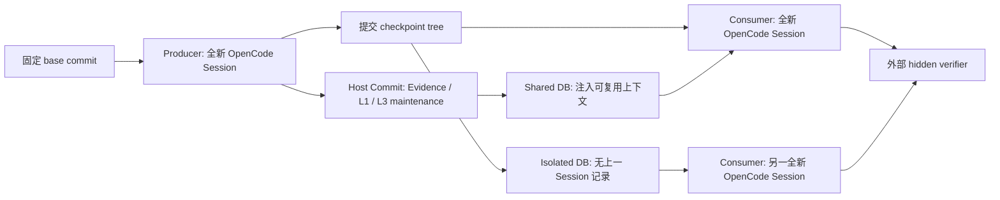

# 10 跨 Session Host 正式实验（2026-08-11）

> 实验对象：RepoMind `1.0.0-rc.1` 当前 Host 分层上下文与自动维护实现
> 固定源码提交：`6d421ddab90d45a2747f1b25c2d270fb3c306e5e`
> 真实 Runner：OpenCode `1.18.15`
> 真实模型：`cliproxyapi/gpt-5.6-luna`
> 正式规模：120 stages，120 process attempts，0 retry
> 最终状态：correctness 与 efficiency 的 Integrity、Acceptance、独立 Audit 全部通过

## 1. 结论先行

这轮实验给出了当前项目迄今最可信的跨 Session 能力证据，但结论必须分成三层。

第一，在 3 个“当前仓库无法恢复关键事实”的 correctness 任务中，每项重复 5 次，shared consumer 的隐藏契约通过率为 `15/15`，isolated consumer 为 `0/15`；两臂公开测试都是 `15/15`。也就是说，差异不是普通测试健康度或 Agent 崩溃造成的，而是上一 Session 留下的 RepoMind 上下文使下一 Session 恢复了正确契约。

第二，在 3 个“两臂都能从仓库重新发现答案”的 efficiency 任务中，每项重复 5 次，共 15 个可比 pair。Shared 相对 isolated 的总体均值变化为：

- Host lifecycle：`-18.055%`，15/15 pairs 更快；
- Agent duration：`-18.186%`，15/15 pairs 更快；
- Total prompt tokens：`-11.854%`，11/15 pairs 更少；
- Output tokens：`-15.034%`，15/15 pairs 更少；
- 成功文件读取：`-23.529%`，10 胜、5 平、0 负。

第三，本轮实际进入 Agent prompt 并承担 uplift 的是 L1。L2 已在 consumer commit 后自动生成，L3 已自动生成/更新并在 start 时被发现，但 L3 因 provenance 已被 L1 覆盖而去重，L2 尚未在下一次 Session 被消费。因此应写“L1-L3 Host 管线已运行到检索、去重和维护，本轮只有 L1 完成跨 Session 消费并产生实测 uplift”，不能写“L1、L2、L3 都已证明提升 Agent”。

## 2. 本轮 120 次与旧版 120 次不是同一个实验

项目里已经存在 2026-08-04 的旧版 RC 120 次结果。本轮也有 120 stages，但设计不同。

| 对比 | 旧版 RC 实验 | 2026-08-11 本轮实验 |
| --- | --- | --- |
| 规模公式 | 8 tasks × 3 arms × 5 repeats | 6 sequences × 2 arms × 2 stages × 5 repeats |
| 实验臂 | no-memory / full-history / RepoMind | isolated / shared |
| Host 路径 | L1-only | 当前分层检索、预算、去重、自动维护路径 |
| 研究问题 | RepoMind 与无记忆、完整历史相比如何 | 同一仓库跨两个 Agent Session 是否正确迁移知识、是否减少重新发现成本 |
| 完整性 | 因 1 次 full-history 证书错误失败，只能作观察性证据 | correctness、efficiency 和独立审计均通过 |
| 可归因结论 | 不能归因到当前分层 Host | 可以归因到 commit `6d421dd` 的当前 Host 实现 |

这一区分很重要。不能把旧版三臂实验的 full-history 比较混入本轮，也不能把本轮两臂结果表述成重新完成了旧版 `8 × 3 × 5`。

## 3. 实验在测什么

每条 sequence 都包含 producer 和 consumer 两个真实编码任务。



两个实验臂的 prompt、模型、base commit、producer 任务、consumer 任务、public checks 和 hidden checks 相同。核心处理差异只有数据库生命周期：

- `shared`：producer 与 consumer 共用同一 RepoMind 项目数据库；
- `isolated`：每个 stage 使用新的数据库，consumer 看不到 producer 的 RepoMind 记录。

代码 checkpoint 链在各臂内独立，但 producer 的确定性 allowlist 和 hidden verifier 保证两个臂进入 consumer 时具有相同预期 tree 变化。Agent 不会收到“你在 shared 臂”之类额外提示。

## 4. 为什么先分 correctness 和 efficiency

两类任务解决不同的统计问题。

### 4.1 Correctness 任务

关键事实由 producer 提供，consumer 当前仓库中不再保留答案。没有跨 Session 记忆时，Agent 只能猜。

| Sequence | Producer 留下的知识 | Consumer 要做的事 |
| --- | --- | --- |
| `corr-release-command` | 已验证的发布检查命令 | 恢复准确的 package release script |
| `corr-stale-endpoint` | jobs cutover 后的真实 endpoint | 更新 client endpoint |
| `corr-error-contract` | parser 的公共错误类型与 code | 恢复 parser 错误契约 |

这里应看 hidden success，而不是比较失败实现的速度。

### 4.2 Efficiency 任务

答案仍可从当前仓库、配置、测试或调用方间接发现，两臂理论上都能正确完成。Shared 的价值是减少搜索和推理成本。

| Sequence | 可重新发现的证据 | Consumer 任务 |
| --- | --- | --- |
| `eff-dependency-boundary` | cache-key vectors、package 依赖边界 | 实现稳定 digest |
| `eff-delivery-failure` | worker contract 与失败历史 | 修复并发 delivery race |
| `eff-gateway-history` | Nimbus runtime 与 telemetry | 增加 retry headers |

Efficiency 只有在两臂 public、hidden 和 authoritative verification 都通过时才进入统计。本轮 coverage 为 `15/15=1.0`。

## 5. 执行流程与可复现性

### 5.1 干净源码快照

主工作树包含开发修改，直接运行会产生 `repoMindDirty=true`，无法形成固定 provenance。因此先建立了独立 clean snapshot：

```text
D:\data\code\project\repomind-test\source-snapshots\repomind-20260811-015202
```

| 项目 | 值 |
| --- | --- |
| Commit | `6d421ddab90d45a2747f1b25c2d270fb3c306e5e` |
| Snapshot algorithm | `repomind-source-snapshot-v1` |
| File count | 348 |
| Snapshot SHA-256 | `67c1fcdc46a3ff3e669c7078437d7d476bd1b5b799bc68b7fea451ec75017e78` |
| ZIP SHA-256 | `7C2855109719C2284BECCE652418D35CB077C67586B0DC89688D9D72DE465A4C` |
| Dirty entries | 0 |

快照中执行 `npm ci`、typecheck、build 和 fixture validator，退出码全部为 0。`npm ci` 同时报告 1 个 moderate、4 个 high 依赖告警；本轮没有运行自动修复，因为升级依赖会改变被冻结测版本。

### 5.2 R4 smoke

先在全新目录运行 efficiency `repeat=1`：

```text
D:\data\code\project\repomind-test\cross-session-smoke-luna-r4-20260811-015202
```

R4 结果为 12 stages、12 attempts、0 retry、3/3 comparable pairs。Integrity、Acceptance、独立 Audit 均通过，才创建另一全新目录运行正式实验。R4 的 Host `-10.326%` 和 total prompt `-10.102%` 只是 smoke 观察；两个主要 CI 都跨 0，不用于正式结论。

### 5.3 Formal suite

```text
D:\data\code\project\repomind-test\cross-session-formal-luna-r5-20260811-021500
```

核心命令：

```powershell
node .\dist\cli\index.js eval --agent-cross-session `
  --manifest <manifest.correctness.json 或 manifest.efficiency.json> `
  --runner opencode `
  --model 'cliproxyapi/gpt-5.6-luna' `
  --repeat 5 `
  --max-memories 5 `
  --context-budget 12000 `
  --timeout 600000 `
  --output <全新结果目录> `
  --strict `
  --require-acceptance `
  --json
```

完整命令、时间、退出码与对应结果见 suite 根目录的 `EXPERIMENT-LOG.md`。

## 6. Correctness 正式结果

### 6.1 通过率

| Sequence | Shared public | Shared hidden | Isolated public | Isolated hidden |
| --- | ---: | ---: | ---: | ---: |
| Release command | 5/5 | **5/5** | 5/5 | **0/5** |
| Stale endpoint | 5/5 | **5/5** | 5/5 | **0/5** |
| Error contract | 5/5 | **5/5** | 5/5 | **0/5** |
| 合计 | 15/15 | **15/15** | 15/15 | **0/15** |

Public checks 两臂都通过，说明普通仓库测试看不出差异。Hidden verifier 专门检查 producer 才知道、consumer 当前仓库中不存在的精确契约。

Observed paired delta 为 `+1.0`，15 胜、0 平、0 负。这个结果在本 fixture 内非常一致，但不是“任何仓库准确率从 0% 到 100%”。样本只有 3 个独特任务，各重复 5 次。

### 6.2 Isolated 为什么失败

- Release command：4 次写成 `node scripts/check-schema.mjs && npm test`，1 次只运行 schema；都不等于已验证命令 `node --test && node scripts/check-schema.mjs`。
- Stale endpoint：2 次猜 `/v2/jobs`，3 次猜 `/api/jobs`；正确契约为 `/v2/tasks`。
- Error contract：3 次缺少 `CONFIG_PARSE_FAILED` code，2 次连预期错误类型也不满足。

Agent 并没有崩溃。15 个 isolated consumer 的模型进程均退出 0，public checks 通过，checkpoint 也成功；随后 hidden verifier 判定语义错误。这个设计避免把服务异常误当成“没有记忆导致失败”。

### 6.3 一个 partial 的解释

`corr-release-command/shared/iteration-2/consumer` 正确实现并通过 public/hidden，checkpoint commit 和 Session 关闭也成功，但一次 Git 检查错误地从 suite 根目录发起，被 OpenCode external-directory 权限拒绝。Agent 后来在正确 run repo 重新验证成功；Host 因 cwd 不同没有把两次命令归为恢复，保守标记为 `partial` 并跳过派生层维护。

所以应表述为：

- 15/15 shared authoritative hidden checks 通过；
- 15/15 checkpoint commit/Session close 成功；
- lifecycle status 是 14 committed、1 partial；
- 不能表述成 15/15 lifecycle 全部 committed。

## 7. Efficiency 正式结果

### 7.1 总体指标

以下 CI 是 `shared-isolated` 绝对配对差值的 95% 正态近似区间。

| 指标 | Isolated mean | Shared mean | 相对变化 | 95% CI | Shared W/T/L |
| --- | ---: | ---: | ---: | ---: | ---: |
| Host lifecycle ms | 90,666.169 | 74,296.178 | **-18.055%** | [-22,102.565, -10,637.417] | 15/0/0 |
| Agent duration ms | 89,923.620 | 73,570.005 | **-18.186%** | [-22,087.026, -10,620.205] | 15/0/0 |
| Raw input tokens | 17,907.333 | 18,705.800 | +4.459% | [-2,160.947, 3,757.881] | 8/0/7 |
| Cache-read tokens | 71,816.533 | 60,381.867 | -15.922% | [-19,803.639, -3,065.695] | diagnostic |
| Total prompt tokens | 89,723.867 | 79,087.667 | **-11.854%** | [-19,699.610, -1,572.790] | 11/0/4 |
| Output tokens | 2,166.133 | 1,840.467 | **-15.034%** | [-438.522, -212.811] | 15/0/0 |
| Successful file reads | 7.933 | 6.067 | **-23.529%** | [-2.912, -0.821] | 10/5/0 |

这组结果同时满足两个要求：两臂都正确，以及 shared 的搜索成本总体更低。总计减少约 245.55 秒 Host 时间、159,543 total-prompt tokens 和 4,885 output tokens。

### 7.2 逐任务异质性

| Sequence | Host 变化 | Total prompt 变化 | Token pair W-L | Output 变化 | Reads 变化 |
| --- | ---: | ---: | ---: | ---: | ---: |
| Dependency | -15.868% | -21.017% | 5-0 | -18.671% | -33.333% |
| Delivery | -16.053% | **+10.385%** | 1-4 | -11.118% | 0% |
| Gateway | -21.580% | -19.613% | 5-0 | -15.271% | -27.273% |

Delivery 是重要反例：shared 仍然 5/5 更快、输出更短，但 total prompt 平均增加 10.385%，CI 也跨 0。说明 RepoMind 不是对每个任务、每个 token 指标都稳定获益；总体 token 结果主要来自 dependency 和 gateway。

### 7.3 为什么不能只看 input tokens

OpenCode/provider 会把 prompt 使用拆成：

```text
totalPromptTokens = inputTokens + cacheReadTokens + cacheWriteTokens
```

本轮 raw input 增加 4.459%，cache-read 减少 15.922%，最终 total prompt 减少 11.854%。只看 raw input 会得到相反方向，测到的更多是 provider 对缓存命中的分摊方式，而不是完整 prompt 工作量。

Total prompt 仍不等于费用。真实成本需要按 provider 对 input、cache-read、cache-write 和 output 的单价分别加权。本轮 cache-write 全为 0，也没有覆盖写缓存成本。

## 8. L1-L3 到底运行到了哪一步

### 8.1 Start 阶段

两个正式 cohort 的 30 个 shared consumers 均满足：

```text
L1 provided=2, eligible=2, injected=2
L2 provided=0, eligible=0, injected=0
L3 provided=1, eligible=1, injected=0, deduplicated=1
```

合计实际注入 60 条 L1。L3 合计发现 30 次，但全部因为其来源 L1 已完整注入而被 provenance-aware dedup；correctness 去重 5,725 chars，efficiency 去重 5,765 chars。所有层的 truncated 和 omitted 都是 0。

这证明分层检索和去重 telemetry 是真实运行的，也证明不会把 L1 与来源完全相同的 L3 重复塞入 prompt。

### 8.2 Commit 阶段

成功 producer commit 后形成 L1 和 L3 v1。成功 consumer commit 后自动创建 `src` 与 `test` 两个 L2 narrative，并把 L3 更新到 v2。L4 没有达到候选条件，因此记录为 skipped；它没有自动 approve、export、install 或 execute。

### 8.3 能与不能声称的内容

可以声称：

- Host 自动完成 Start -> L1-L3 检索/预算/去重 -> Agent -> Commit -> L2/L3 maintenance；
- 下一 Session 确实消费了 L1；
- L3 确实被发现并因来源覆盖正确去重；
- L2/L3 确实在成功 commit 后自动维护；
- L4 保持人工审批边界。

不能声称：

- L2 或 L3 已在本轮单独产生正确率或效率提升；
- 12k 预算在高压力下已经验证。本轮 shared consumer context 约 0.9-1.3k chars；
- current L1-L3 路径已经跨 Agent/跨 provider 正式验证。

要验证 L2/L3 消费，需要第三个 Session，使任务依赖 consumer commit 后才生成的 L2/L3 非重复信息。

## 9. Integrity 与独立审计

两个正式 cohort 分别满足：

| 审计项 | Correctness | Efficiency |
| --- | ---: | ---: |
| Stage runs | 60/60 | 60/60 |
| Process attempts | 60 | 60 |
| Retry / exhausted | 0 / 0 | 0 / 0 |
| 独立 Git repositories | 60 | 60 |
| SQLite databases | 45 | 45 |
| Event logs | 60 | 60 |
| 审计组 | 14/14 | 14/14 |
| Audit failures | 0 | 0 |
| 成功 read-class tools | 641 | 666 |
| Leakage findings | 0 | 0 |

独立审计覆盖：

- summary schema、manifest identity 与 SHA-256；
- repeat/stage/attempt/retry 重算；
- 结果路径 containment 和确定性布局；
- initial cleanliness、changedFiles 与 exact allowlist；
- 独立 parentless Git checkpoint、object store、refs、remotes、alternates、promisor、shallow；
- SQLite integrity、foreign keys、Session/Host Run 关闭状态；
- shared/isolated L1-L3 处理约束；
- 每个 attempt 的 OpenCode structured events、tokens、tool/file reads 和终止状态；
- hidden、sibling runs、其他 results、RepoMind data/source 的读写泄漏；
- 固定 runner、model、budget、repeat、stage count、source commit 与 source snapshot hash；
- 源码和 hidden verifier 前后不变。

审计器 SHA-256 为：

```text
C491A83B280B5DE64FD055C9949F814700C80785009FD14080DA4DED75E0EBD7
```

## 10. Partial、失败读取与重试

本轮没有任何基础设施 retry：120 stages 恰好对应 120 process attempts。

Efficiency 有两个 isolated producer 被保守标成 partial。它们同样把 Git 验证命令指向 suite 根目录而被 external-directory 权限拒绝，之后在正确 run repo 验证成功；public/hidden/checkpoint 均通过。两者都不属于 15 个 consumer efficiency pairs。

Efficiency 事件中共有 13 个 failed tools：2 个上述 bash unknown-result，加 11 个失败文件读取。失败读取主要是 Agent 拼错绝对路径；审计确认没有读取 hidden、兄弟 run 或数据目录。正式 `fileReads` 指标只统计成功读取，这是当前 schema 的明确口径。

这些 partial 没有被删除或重跑。保留它们可以防止对结果进行事后挑选，也暴露出通用 Host adapter 仍可改进的一点：恢复命令匹配需要考虑 Agent 修正 cwd 后的等价验证。

## 11. 统计解释边界

1. 报告 CI 使用 `1.96 × paired standard error` 正态近似；每个 sequence 只有 5 pairs，更稳健的 Student-t 或 bootstrap 区间会更宽。
2. 总体 15 pairs 实际聚类于 3 个任务模板，没有 cluster-robust 调整或多重比较校正。
3. Correctness 的 15 次不是 15 个独立真实项目，而是 3 类任务各 5 次。
4. 结果只覆盖 Windows、OpenCode 和 `cliproxyapi/gpt-5.6-luna`；不能直接外推 Claude、Codex、Linux、其他 provider 或大型真实仓库。
5. Synthetic fixture 的价值是控制变量和隐藏事实隔离，不等同于生产 workload 覆盖。
6. Acceptance 阈值在运行前由 manifest 固定；独立 audit 验证完整性，但不会替代效果阈值的领域判断。

因此最严谨的表述是：

> 在 6 条预注册的两阶段合成 sequence、OpenCode/Luna/Windows 固定环境中，当前 RepoMind Host 的 shared 跨 Session 上下文通过了完整性和效果门禁。Correctness 组的隐藏契约由 isolated 0/15 提升到 shared 15/15；在两臂均正确的 efficiency 组中，shared 平均减少 18.055% Host 时长和 11.854% total-prompt tokens。该 uplift 本轮由 L1 注入承担，L2/L3 已自动维护但尚未证明被后续 Agent 消费。

## 12. 对项目完整度的影响

这轮实验显著提高了项目“相对完整”的可信度：

- partial 门禁不再把语义失败误当基础设施重试；
- telemetry 能区分 input/cache-read/cache-write/total prompt、成功/失败读取、去重和 candidate chars；
- runner 能在重复间轮换 arm 顺序；
- 正式实验能从 clean source snapshot 复现，并由独立审计器验证；
- 当前 Host 在受控真实 Agent 场景中同时出现正确性迁移和总体效率收益。

但它还不是可以停止迭代的生产级结论。剩余最高价值工作是：

1. 增加三阶段 L2/L3 消费实验，并加入 2k/4k 紧预算条件；
2. 在 Claude endpoint 稳定后运行 `manifest.cross-agent.json --repeat 5`，完成 Claude -> OpenCode 与 OpenCode -> Claude 共 40 stages；
3. 使用已接入且有单测的 Claude Host Adapter 完成第二个真实 Agent 的正式验收；
4. 将任务扩展到多个真实开源仓库，预注册仓库级分层分析；
5. 使用 bootstrap、Student-t 或 cluster-robust CI，并按真实 provider 价格计算成本；
6. 修正跨 cwd 的恢复命令匹配，减少正确运行被保守标成 partial。

## 13. 面试中如何准确介绍

推荐说法：

> 我实现了一个由 Agent Host 托管的仓库级持久记忆闭环。Host 在 Session start 按 12k 字符预算检索 L1-L3，并基于 provenance 去重；Agent 完成任务后，Host 原子提交 Session，再自动维护 L2/L3，L4 只生成待审候选。为验证它，我在 clean commit 上运行了 120 个真实 OpenCode/Luna stages，并用外置 hidden verifier 和独立审计器检查 Git、SQLite、事件和数据泄漏。3 个正确性任务各 5 次中，共享记忆使 hidden pass 从 0/15 到 15/15；3 个两臂都正确的效率任务中，Host 时长均值下降 18.1%，total-prompt tokens 下降 11.9%。我同时保留了 3 个 partial 样本并明确指出：本轮 uplift 来自 L1，L2/L3 的真实消费和跨 Agent 仍需下一轮实验。

不推荐说法：

- “准确率普遍提升 100%”；
- “L1-L3 都已经证明有效”；
- “Token 或 API 费用必然下降”；
- “已经完成 Claude/OpenCode 跨 Agent 正式验证”；
- “所有 Session 都成功，没有异常”；
- “120 次实验等于 120 个独立真实项目”。

## 14. 原始证据

完整命令和结果日志：

```text
D:\data\code\project\repomind-test\cross-session-formal-luna-r5-20260811-021500\EXPERIMENT-LOG.md
```

关键哈希：

| 文件 | SHA-256 |
| --- | --- |
| Correctness manifest | `D736F038F5AD528FF38592D871E93A8E5E7B5A94CC0A77D2FC936853E4B28F45` |
| Efficiency manifest | `A8F7C0B51452D7B4B1A61AA4A294B961C1E6E64C8F158A8EC6542F1B1139FAD5` |
| Correctness summary | `EF30201219BD0E4D5542079D6637A2A8D13E0FF440912ED6C1CA4A9025399389` |
| Efficiency summary | `14A799103E121C1E6F767032143480A6CAE4B83AB89250A909E211B59ABF524F` |
| Correctness audit | `5DCBFDC443A1B572B5E2667DF3456381F3711A5AE2A9ADD22554F238416E02E1` |
| Efficiency audit | `DB35267F4A73134445FB3854FDF40F334A9EC1E117B04277364C43935567A054` |

Formal suite 保留约 7,024 个文件、55.9 MiB，包括每个 Agent attempt 的 JSONL/stdout/stderr、每个 stage 的独立 Git 仓库、每个项目/实验臂的 SQLite 数据库和审计 JSON。没有删除失败或 partial 证据。
